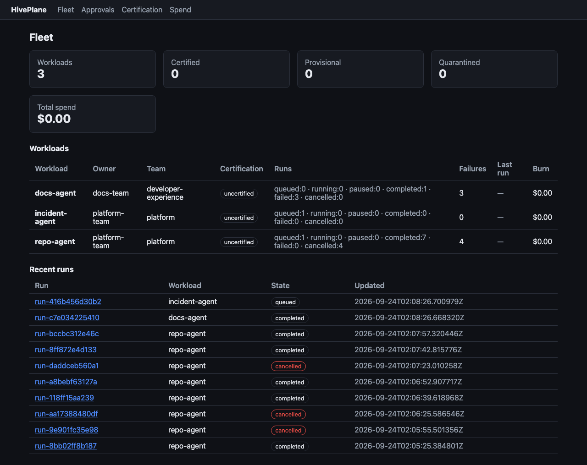
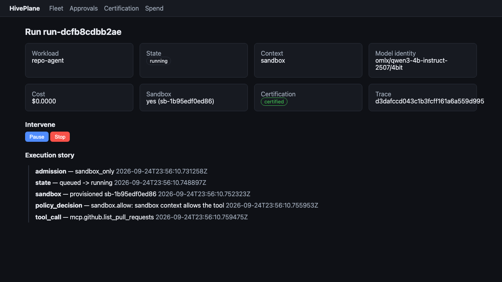
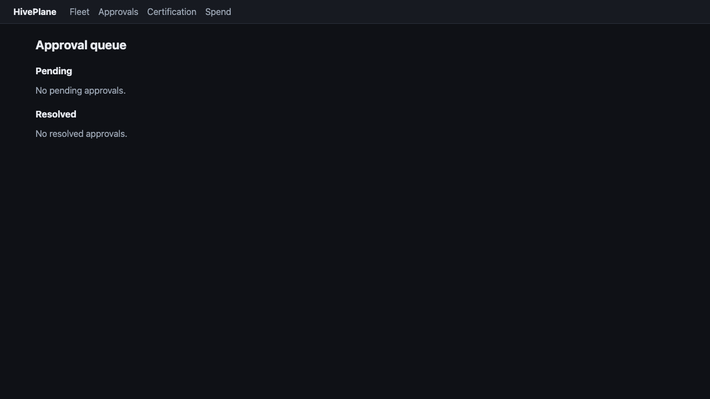
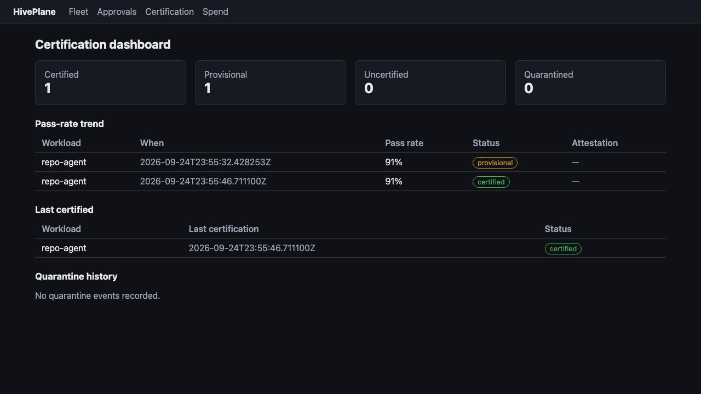
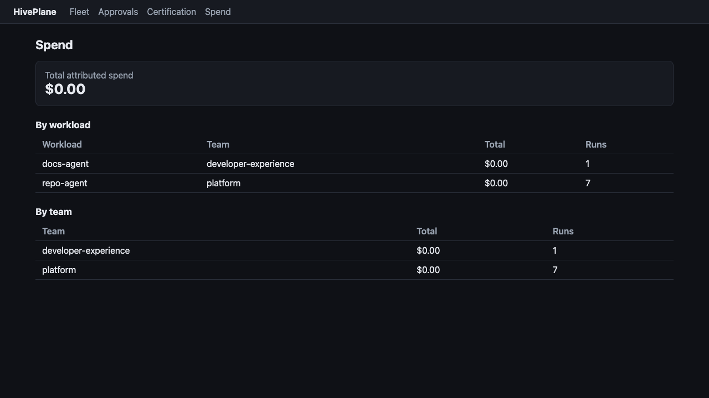

# HivePlane User Guide

> Status: draft — to be completed with v0.1.0.

## What HivePlane Is

HivePlane is a control plane for operating a fleet of AI agents as first-class workloads. You register each agent, declare who owns it, what tools it may call, what it may spend, and what approvals it requires — then observe and intervene from one operator surface.

## Prerequisites

- Docker (for the reference local stack)
- Python 3.11+ (for the API and worker examples)

## Quick Start

```bash
# 1. Start the local control plane
docker compose up -d

# 2. Scaffold a project (optional): workloads, sample corpus, README
hiveplane init myproject

# 3. Register an agent workload
hiveplane register examples/workloads/example-agent.yaml

# 4. Submit a task (task payload is a JSON object)
hiveplane submit --agent example-agent --task '{"repo": "hiveplane"}'

# 5. Inspect the run
hiveplane runs list
hiveplane runs show <run-id>

# 6. Intervene
hiveplane runs pause <run-id>
hiveplane runs resume <run-id>
hiveplane runs stop <run-id>
```

## Operator CLI

Every command talks to the control-plane API and accepts `--api-url`
(default `http://localhost:8000`). Documents passed to `--file` may be YAML or JSON.

| Command | Purpose |
|---------|---------|
| `hiveplane init [DIR] [--force]` | Scaffold a project with a sample workload, corpus, and README |
| `hiveplane validate <manifest>` | Validate a manifest against the strict schema |
| `hiveplane register <manifest> [--dry-run]` | Register a workload, or preview enforcement |
| `hiveplane certify <workload> [--context staging\|production] [--corpus ...]` | Run the corpus and certify |
| `hiveplane certs list\|show\|compare` | Inspect, show, and diff certifications |
| `hiveplane submit --agent <name> [--task JSON] [--caller ...] [--context ...] [--model-identity ...]` | Submit a run |
| `hiveplane runs list [--workload ...] [--state ...]` | List runs |
| `hiveplane runs show\|pause\|resume\|stop <run-id>` | Inspect and intervene on a run |
| `hiveplane approvals list [--status ...] [--workload ...]` | List approval requests |
| `hiveplane approvals approve\|deny <id> --operator <name> [--reason ...]` | Resolve an approval |
| `hiveplane triggers list --workload <name>` | List a workload's trigger rules |
| `hiveplane triggers add --workload <name> --file <rule>` | Add a trigger rule |
| `hiveplane tools list [--trust-level ...] [--mcp-server ...]` | List registered MCP tools |
| `hiveplane tools add --file <tool>` | Register an MCP tool |
| `hiveplane reconcile status --source <id>` | Show a source's last revision, reconcile time, and open drift |
| `hiveplane reconcile plan\|apply --source <id> --path <dir>` | Dry-run or apply a GitOps reconcile of a directory source |
| `hiveplane reconcile plan\|apply --source <id> --kind git --git-url <url> [--git-ref <ref>]` | Dry-run or apply a reconcile of a git source |

## Desired-State Reconciliation (GitOps)

Declare the fleet as a manifest set (workloads, policy packs, triggers, budgets) in a
directory or git repo, and let the controller converge actual state to it. A reconcile
pass observes, diffs, plans, acts, and records — and `plan` mutates nothing.

```bash
# Dry-run: show the action set without changing anything
hiveplane reconcile plan --source fleet-main --path ./fleet

# Apply: register missing workloads, update changed manifests, re-cert on threshold changes
hiveplane reconcile apply --source fleet-main --path ./fleet

# Status: last revision, last reconcile, open drift
hiveplane reconcile status --source fleet-main
```

Guardrails are safe by default: destructive actions (deregister, quarantine) are blocked
unless `HIVEPLANE_RECONCILE__ALLOW_DESTRUCTIVE=true`, an empty desired set cannot cascade
to mass deregistration (`ALLOW_EMPTY`), the first reconcile against unknown state needs
`--confirmed`, and destructive actions are rate-limited per pass. Declarative `spec.*`
fields are declared-wins; runtime, certification status, and pinned fields are
observed-wins and are recorded as drift rather than overwritten. Reconcile is
single-writer: a PostgreSQL advisory lock keyed by source id stops a second replica from
double-acting.

## Trigger Service (Autonomy)

Declare a trigger, then let external events start runs. A trigger document names a
`source` (webhook, github, alertmanager, cron, watch), a `target` workload or pipeline,
an event `filter`, an injection-safe `task_template`, dedup/cooldown/rate-limit controls,
and an `admission_rule` (`staging-auto` auto-admits staging, `gated` sends production
through approvals, `deny` refuses). Production admission still requires a valid
certification regardless of trigger trust.

```bash
# Register a webhook trigger (POST /triggers)
curl -X POST localhost:8100/triggers -H 'content-type: application/json' -d '{
  "id": "pr-analysis", "source": "webhook",
  "target": {"kind": "workload", "ref": "repo-agent"},
  "task_template": {"pr": "{{ event.number }}"},
  "admission_rule": "staging-auto"
}'

# Deliver a signed event. The signature is HMAC-SHA256 over "timestamp.nonce.raw_body".
curl -X POST localhost:8100/triggers/webhook/pr-analysis \
  -H "X-HivePlane-Timestamp: $TS" -H "X-HivePlane-Nonce: $NONCE" \
  -H "X-HivePlane-Signature: sha256=$SIG" -d '{"number": 42}'
```

A bad/missing signature returns 401, a replayed `(timestamp, nonce)` returns 409, a
duplicate dedup key returns 409, and a burst past the rate bucket returns 429. Inspect
history with `GET /triggers/{id}/events` and `GET /triggers/{id}/runs`; failed deliveries
park in `GET /triggers/dlq`. Webhook secrets come from
`HIVEPLANE_TRIGGERS__SECRETS` until the secrets store (M45) lands.

### Sources, admission, freeze, and replay

Provider-specific endpoints verify provider signatures and normalize payloads:
`POST /triggers/github/{id}` (`X-Hub-Signature-256`; PR/push/label, and a `/hiveplane`
PR comment re-triggers) and `POST /triggers/alertmanager/{id}` (one event per alert,
deduped by `fingerprint`). `admission_rule` selects the run context: `staging-auto`
auto-admits staging, `gated` holds production for approval (certification still applies),
`deny` refuses. A freeze window suppresses matching triggers and drains in-flight runs:

```bash
# Declare a workload-scoped freeze for 30 minutes (drain gracefully).
curl -X POST localhost:8100/triggers/freezes -H 'content-type: application/json' -d '{
  "freeze_id": "deploy-1", "scope": "workload", "scope_ref": "repo-agent",
  "starts_at": "2026-01-01T00:00:00Z", "ends_at": "2026-01-01T00:30:00Z",
  "declared_by": "operator", "drain": "graceful"
}'
```

`hiveplane triggers list|show|create|test|replay|enable|disable` drives the trigger
service; `test` renders a payload without submitting, and `replay <dlq-id>` re-drives a
parked delivery. Every decision is recorded with a reason and audited.

## Multi-Agent Pipelines

A pipeline is a declarative DAG of workloads and control steps. Nodes hand off
structured outputs (`${node.output.field}`), fan out over a list and reduce the
aggregate, pause on approval gates, and share a cumulative budget. Validation rejects
cycles before any run starts, and every handoff is schema-checked at both boundaries
against a workload's `spec.io` schemas.

```yaml
# pipeline.yaml
id: incident-response
name: Incident response
budget: { usd: 25.00, on_exceed: pause }
nodes:
  - { id: triage, kind: workload, workload: incident-triage-agent }
  - { id: remediate, kind: workload, workload: remediation-agent,
      inputs: { diagnosis: "${triage.output.diagnosis}" }, requires_approval: before }
  - { id: notify, kind: workload, workload: notify-agent,
      inputs: { summary: "${remediate.output.summary}" } }
edges:
  - { from: triage, to: remediate }
  - { from: remediate, to: notify }
```

```bash
curl -X POST localhost:8100/pipelines -H 'content-type: application/json' -d @pipeline.yaml
hiveplane pipelines submit --pipeline incident-response --inputs inputs.json
hiveplane pipelines status <pipeline-run-id>
hiveplane pipelines retry --run <pipeline-run-id> --node remediate
```

Node kinds are `workload`, `fan_out` (map over a list), `fan_in` (reduce with
`json_merge`/`concat`/`sum`/`first_success`), `gate` (approval only), and `transform`
(deterministic data step). `on_failure` is `fail_fast` (cancel siblings, skip the rest)
or `continue` (independent nodes finish); `retry.max_attempts` re-runs a failed node.
Child runs carry `pipeline_origin` attribution and go through the same admission,
policy, and budget path as any run.

## Smart Task Router

Set `HIVEPLANE_ROUTER__ENABLED=true` to expose `POST /route`. The router scores
only workloads certified for the target context and picks one only when it clears
the confidence threshold and beats the runner-up by the margin; otherwise it
refuses with ranked candidates rather than guessing.

```bash
hiveplane route "the checkout database is down" --context production
# routed to incident-triage-agent  (score 0.91)
# classifier: router-classifier
```

```bash
curl -X POST localhost:8100/route -H 'content-type: application/json' \
  -d '{"task": "summarize the weekly incident report", "context": "staging"}'
```

The response carries the ranked `candidates`, the chosen workload, the
`classifier_model`, and the thresholds. Decisions are recorded (`GET /routes`) so
a route can be explained after the fact; the raw task text is never stored, only
its digest. Tune guardrails with `HIVEPLANE_ROUTER__CONFIDENCE_THRESHOLD` and
`HIVEPLANE_ROUTER__MARGIN` — a wrong route that bypasses the specialist is worse
than a refusal, so keep them conservative.

## Agent-as-Tool

A certified workload is callable as `agent.<workload>`. Each call submits a nested
run that inherits the caller's context and passes the same certification, policy,
and budget admission as any run.

```bash
hiveplane agents list --context staging
hiveplane agents invoke agent.incident-triage-agent --caller-run run-abc --task task.json
```

Recursion is bounded: `max_agent_depth` (default 5) rejects calls that nest too
deep, the workload chain is checked for cycles, and a call is refused when the
nested workload is uncertified or the caller's budget is exhausted. Every
invocation — allowed or refused — is attributed and recorded.

Cross-plane A2A interop is available behind `HIVEPLANE_A2A__ENABLED=true`
(stretch): `GET /a2a/agents` exposes certified workloads as A2A agent cards and
`POST /a2a/tasks` maps an inbound task onto the router and run lifecycle. Only
planes listed in `HIVEPLANE_A2A__ALLOWED_PLANES` are trusted.

## Runtime Adapters & Bring Your Own Agent

HivePlane runs workloads through one of four adapters: `raw-worker`, `langgraph`,
`pydanticai`, and `openai-agents`. Select one globally with
`HIVEPLANE_EXECUTION__ADAPTER` or use `auto` to route each workload by its
manifest. All adapters conform to contract v2 and report the model identity
captured from actual inference.

```bash
hiveplane adapters list          # contract version + capabilities per adapter
```

Install a framework extra and point the manifest at an entrypoint:

```bash
pip install "hiveplane[pydantic-ai]"      # or "hiveplane[openai-agents]"
```

```yaml
# workload.yaml
spec:
  runtime:
    adapter: pydanticai
    entrypoint: myapp:build        # build(model) -> Agent
```

Inference is governed: the adapter replaces the framework's model with one that
routes through the control plane, so certification, identity checks, pricing, and
budget enforcement all apply.

To onboard an existing app without editing it:

```bash
hiveplane wrap ./my-app --framework auto --out ./wrapped
hiveplane wrap ./my-app --dry-run          # print the plan, write nothing
```

`wrap` scans the app statically (never imports or runs it) and writes an
uncertified `workload.yaml`, an `adapter_scaffold.py`, a `corpus.template.yaml`,
and a `README.md` into `--out`. It never writes to the source tree; generated
files are inert until you register and certify them, and an uncertified wrapped
app is refused production admission.

## Operator UI

The operator UI is a server-rendered web app that reads the same HTTP API as the
CLI. It gives you fleet health at a glance and lets you act, not just look.

```bash
# Local (after `docker compose up -d`), or run it directly:
docker compose up -d ui
# -> http://localhost:3001

# Or run the UI server yourself against a control plane:
HIVEPLANE_UI__API_URL=http://localhost:8000 hiveplane-ui
```

The base URL is configured with `HIVEPLANE_UI__API_URL` (default
`http://localhost:8000`). The UI is itself an HTTP client of the API; if the API
is unreachable it renders a controlled "control plane unavailable" page.

| Screen | What it shows | Actions |
|--------|---------------|---------|
| **Fleet** (`/`) | Per workload: owner, team, certification status, run state counts, recent failures, last run, budget burn; fleet totals | Follow run links into run detail |
| **Run detail** (`/runs/{id}`) | State timeline, tool/model calls, cost, sandbox, trace link, approvals | Pause, resume, stop |
| **Approvals** (`/approvals`) | Pending escalations and resolved history | Approve, deny (operator + reason) |
| **Certification** (`/certifications`) | Status counts, pass-rate trend, last certified, quarantine history, attestation links | — |
| **Spend** (`/spend`) | Attributed spend by workload and by team | — |

### Screens

The screenshots below are captured deterministically by the Docker test suite's
Playwright layer (L3) and regenerated on every `make docker-test` run into
`docs/field-test/v0.1.0/screenshots/` (see the
[Docker test report](field-test/v0.1.0/DOCKER_TEST_REPORT.md), #95).

**Fleet** — certification status, run-state counts, and budget burn per workload:



**Run detail** — state timeline with tool calls, model calls, usage, and approvals:



**Approvals** — pending escalations with approve/deny:



**Certification dashboard** — status counts, pass-rate trend, and quarantine history:



**Spend** — attributed spend by workload and team:



### Running the UI browser tests

```bash
make test-e2e   # installs Chromium, runs tests/e2e
```

These Playwright tests start a real control plane and UI in-process, seed a
scenario, and drive Chromium through every screen and action. They are marked
`e2e`, so `make test` (and the coverage gate) excludes them.

## Core Concepts

| Concept | Meaning |
|---------|---------|
| **Agent workload** | A registered agent with an owner, runtime, tools, budget, and approval policy |
| **Manifest** | The declarative YAML that defines a workload |
| **Run** | One execution of a workload, with persistent state |
| **Policy** | Rules governing tool permissions, budgets, and approvals |
| **Adapter** | The bridge between HivePlane and a runtime (LangGraph, raw worker) |

See [prd/04-users-and-cujs.md](prd/04-users-and-cujs.md) for critical user journeys.

## Execution API

The run lifecycle is exposed over HTTP:

| Method | Path | Purpose |
|--------|------|---------|
| `POST` | `/runs` | Submit a run for admission |
| `GET` | `/runs` | List runs (`?workload=`, `?state=`) |
| `GET` | `/runs/{id}` | Inspect a run |
| `GET` | `/runs/{id}/events` | Read the attributed event log |
| `GET` | `/runs/{id}/usage` | Read usage reports |
| `POST` | `/runs/{id}/start` | Start a queued run (adapter pickup or operator) |
| `POST` | `/runs/{id}/pause` | Pause a running run |
| `POST` | `/runs/{id}/resume` | Resume a paused run |
| `POST` | `/runs/{id}/stop` | Stop a run immediately |
| `POST` | `/runs/{id}/tool-calls` | Authorize a tool call (policy + egress + shaping) |

Submission runs admission checks in order — certification status, model-identity
binding, budget, policy, and sandbox requirement. A refusal returns `403` with the
failing step and reason. Illegal transitions return `409`, and unknown runs `404`.

Run state is persisted through a pluggable store (durable JSON files by
default, or in-memory), every transition is recorded as an attributed event, and
terminal runs fan out to the destinations configured in `spec.fan_out` (Slack and
generic webhook in v0.1.0).

### Tool calls

Adapters authorize every tool call at the control-plane boundary via
`POST /runs/{id}/tool-calls` (body: `tool_id`, optional `action_class`,
`data_sensitivity`, `tool_trust`, `output`, `host`). The boundary evaluates
deny-by-default policy with the full tool context, enforces the manifest's
sandbox egress allowlist for any `host`, and shapes `output` (filter, truncate,
injection scan) before it reaches the agent. Escalations pause the run and open an
approval; every decision is recorded as a `policy_decision` run event.

> With no runtime adapter installed, nothing calls the boundary automatically —
> adapters (M16-M17) route their tool calls through it.

> Status: the policy, budget, and sandbox engines are wired in. PostgreSQL
> persistence lands with the state-store milestone.

## Policy and Approvals

Policy is evaluated deny-by-default and returns an explainable decision (the
originating `rule`, a `reason`, and a blast-radius score):

| Method | Path | Purpose |
|--------|------|---------|
| `POST` | `/policy/evaluate` | Evaluate policy for a context (tool, environment, sensitivity) |
| `GET` | `/policy-packs` | List team policy packs |
| `POST` | `/policy-packs` | Register a team policy pack |
| `GET` | `/approvals` | List approval requests (`?status=`, `?workload=`) |
| `GET` | `/approvals/{id}` | Inspect an approval request |
| `POST` | `/approvals/{id}/approve` | Approve and resume the paused run |
| `POST` | `/approvals/{id}/deny` | Deny and fail the paused run |

A destructive tool, an explicit `require_approval`, or an action class listed in
`spec.approvals.required_for` escalates a run: admission pauses it, requests an
approval, and fans out to `spec.fan_out.on_escalation`. Approving resumes the
run; denying fails it with the recorded reason.

## Budget

Usage is priced from the exact model identity via a per-model cost table
(token prices per 1,000 tokens); an unknown model fails loudly rather than
silently costing zero. Spend is enforced at three levels:

- **Per run** — `spec.budget.per_run_usd`
- **Per day** — `spec.budget.per_day_usd` (per workload)
- **Per team** — `spec.budget.per_team_usd` (aggregate across the team)

Admission checks day and team headroom before a run is queued. As usage is
recorded, spend accumulates against the run, the workload's day total, and the
team's day total; a run that exceeds its limit transitions to `failed` with the
budget reason recorded. Every usage event is attributed for showback
(`budget.models.CostAttribution`).

## Execution Sandbox and Output Shaping

Sandboxed runs (a workload with `spec.sandbox.enabled`, or any run in the
`sandbox` context) are provisioned an isolated execution context when they start
and torn down on every terminal transition. The local backend runs the workload
in a subprocess with:

- **Resource caps** — memory (`RLIMIT_AS`), CPU (`RLIMIT_CPU`), and a wall-clock
  watchdog; a run that exceeds the wall-clock cap is terminated and reported as
  `failed` with reason `timeout`.
- **Restricted egress** — `EgressGuard` enforces the manifest allowlist and
  always denies cloud metadata endpoints (`169.254.169.254`).
- **Isolated filesystem** — an ephemeral scratch directory, removed on exit.

Tool outputs are shaped before they reach the agent via `ShapingPipeline`:
filter (redact/mask), truncate to `max_bytes` (head/tail/summary), a cumulative
per-run output budget, and an injection scan. High-confidence injection patterns
are blocked; lower-confidence patterns escalate; benign output passes unchanged.

## Certification

Certification is the thesis: an agent earns production admission by passing a
reproducible benchmark corpus, and the result is a signed attestation.

| Method | Path | Purpose |
|--------|------|---------|
| `POST` | `/certifications` | Run a workload's corpus and certify it |
| `GET` | `/certifications` | List records (`?workload=`, `?status=`) |
| `GET` | `/certifications/{id}` | Show a record (certification, attestation, result) |
| `GET` | `/certifications/compare/{v1}/{v2}` | Per-task regression diff between two certifications |

From the CLI:

```bash
hiveplane certify repo-agent --context staging
hiveplane certs list --workload repo-agent
hiveplane certs show <certification-id>
hiveplane certs compare <v1> <v2>
```

A corpus is a versioned `corpus.yaml` (see
[corpus-format.md](workloads/corpus-format.md)). The runner evaluates
deterministic `exact_match` and `action_audit` checks; the engine applies
staging/production thresholds and advances status (`uncertified → provisional →
certified`, or `quarantined` on a failed re-certification). Each certification
produces an Ed25519-signed attestation stored append-only and verified on every
read. Production admission requires the referenced attestation to verify and the
run's model identity to match the attestation — a model swap is refused.

> Local runs use a `ReferenceExecutor` that replays each task's declared outcome
> until runtime adapters (Part 8) land. It exercises the full flow but does not
> measure a real agent, so it is **off by default**: certification returns `503`
> unless `HIVEPLANE_CERTIFICATION__EXECUTOR=reference` is set explicitly.

## Configuration

| Variable | Default | Purpose |
|----------|---------|---------|
| `HIVEPLANE_CERTIFICATION__EXECUTOR` | `none` | `reference` enables the local replay executor (demo/CI only) |
| `HIVEPLANE_CERTIFICATION__CORPORA_DIR` | `examples` | Root directory corpora are loaded from |
| `HIVEPLANE_EXECUTION__STORE` | `json` | Run store: `json` (durable), `memory`, or `postgres` |
| `HIVEPLANE_EXECUTION__DATA_DIR` | `.hiveplane/runs` | Directory for the durable run store |
| `HIVEPLANE_EXECUTION__ADAPTER` | `none` | `raw-worker` enables in-process workload execution |
| `HIVEPLANE_EXECUTION__ENTRYPOINTS_ROOT` | `.` | Root directory workload entrypoints are loaded from |
| `HIVEPLANE_DATABASE__*` | localhost:5432 | PostgreSQL connection (used when store is `postgres`) |

### Persistence

Set `HIVEPLANE_EXECUTION__STORE=postgres` to run the control plane on PostgreSQL. Run migrations
first:

```bash
alembic upgrade head
```

Runs, run events, usage, admissions, and deliveries are persisted in PostgreSQL, and operator
actions plus terminal transitions are written to a tamper-evident `audit_log` (chained SHA-256).
Verify the chain with `hiveplane`'s audit helpers or by recomputing `AuditChain.verify` over
`audit_log`. When the store is `json`, durability comes from one atomic file per run and audit
falls back to an in-memory log.

Unknown configuration lives in `hiveplane.config` as it lands in v0.1.0.

## Troubleshooting

To be completed alongside v0.1.0.

## See Also

- [Docs index](README.md)
- [Workload manifest format](design/workload-manifest-design.md)
- [Adapters](ADAPTERS.md)
