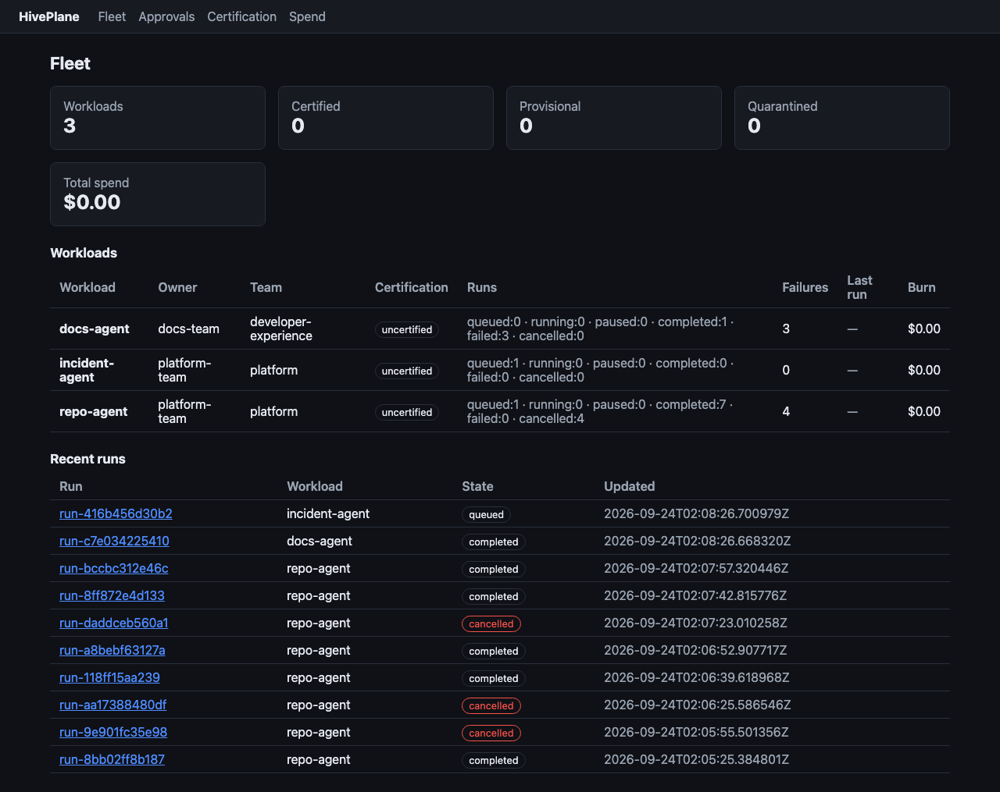
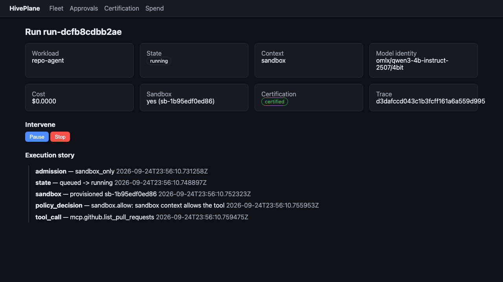
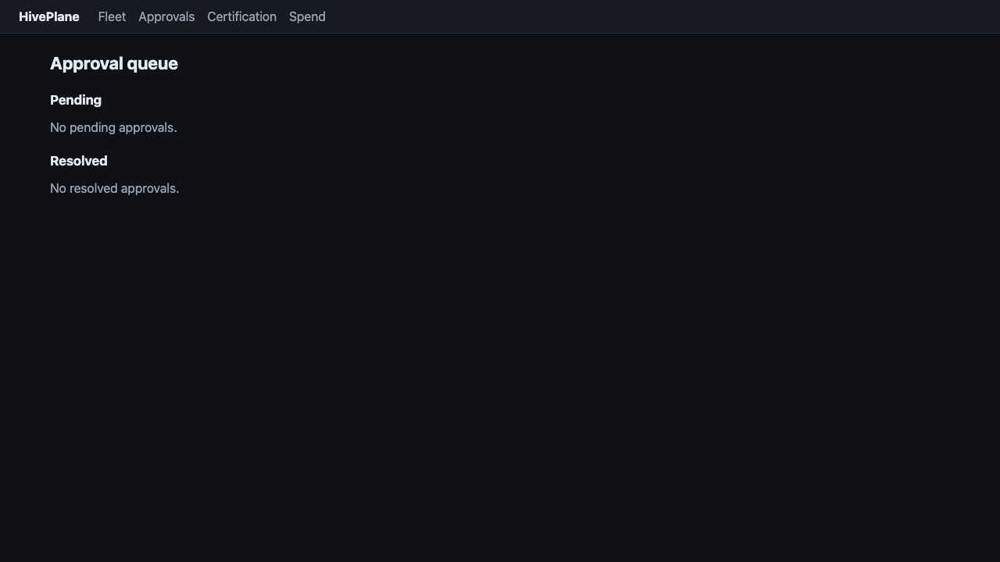
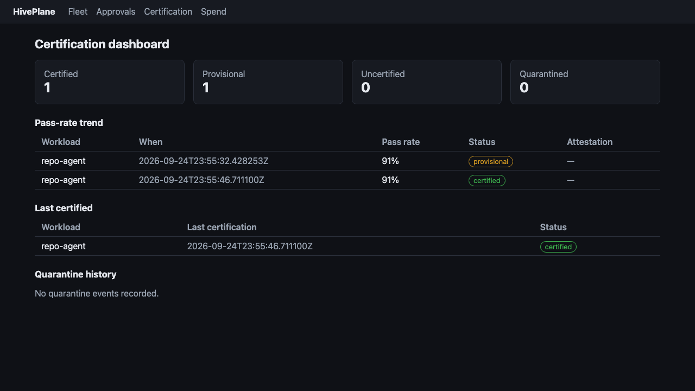
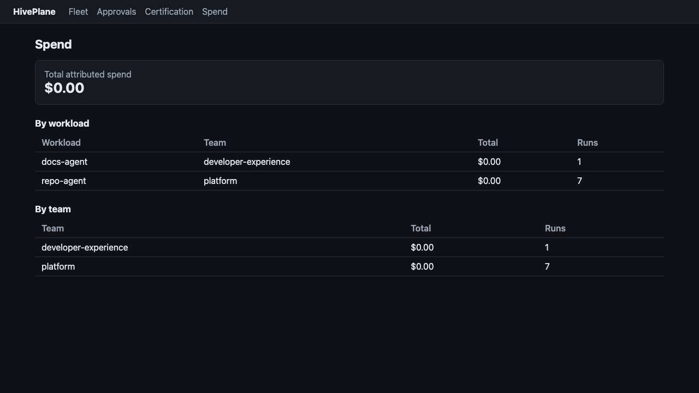

# HivePlane User Guide

> Status: complete for **v0.2.0 (beta)** — the Complete Fleet OS.

> **New here?** Start with the [Tutorials](tutorials/) and the
> [Architecture Tour](architecture-tour.md). **On call?** Keep the
> [Operator Runbook](runbooks/operator-runbook.md) open. Upgrading from v0.1.0? See the
> [Migration Guide](release/v0.2.0/migration-guide.md).

## What HivePlane Is

HivePlane is a control plane for operating a fleet of AI agents as first-class workloads. You register each agent, declare who owns it, what tools it may call, what it may spend, and what approvals it requires — then observe and intervene from one operator surface.

## Prerequisites

- Docker (for the reference local stack)
- Python 3.11+ (for the API and worker examples)

## Quick Start

```bash
# 1. Start the local control plane
docker compose up -d

# 2. Scaffold a project (optional): workloads, sample corpus, README
hiveplane init myproject

# 3. Register an agent workload
hiveplane register examples/workloads/example-agent.yaml

# 4. Submit a task (task payload is a JSON object)
hiveplane submit --agent example-agent --task '{"repo": "hiveplane"}'

# 5. Inspect the run
hiveplane runs list
hiveplane runs show <run-id>

# 6. Intervene
hiveplane runs pause <run-id>
hiveplane runs resume <run-id>
hiveplane runs stop <run-id>
```

## Operator CLI

Every command talks to the control-plane API and accepts `--api-url`
(default `http://localhost:8100`). Documents passed to `--file` may be YAML or JSON.

| Command | Purpose |
|---------|---------|
| `hiveplane init [DIR] [--force]` | Scaffold a project with a sample workload, corpus, and README |
| `hiveplane validate <manifest>` | Validate a manifest against the strict schema |
| `hiveplane register <manifest> [--dry-run]` | Register a workload, or preview enforcement |
| `hiveplane certify <workload> [--context staging\|production] [--corpus ...]` | Run the corpus and certify |
| `hiveplane certs list\|show\|compare` | Inspect, show, and diff certifications |
| `hiveplane submit --agent <name> [--task JSON] [--caller ...] [--context ...] [--model-identity ...]` | Submit a run |
| `hiveplane runs list [--workload ...] [--state ...]` | List runs |
| `hiveplane runs show\|pause\|resume\|stop <run-id>` | Inspect and intervene on a run |
| `hiveplane approvals list [--status ...] [--workload ...]` | List approval requests |
| `hiveplane approvals approve\|deny <id> --operator <name> [--reason ...]` | Resolve an approval |
| `hiveplane triggers list --workload <name>` | List a workload's trigger rules |
| `hiveplane triggers add --workload <name> --file <rule>` | Add a trigger rule |
| `hiveplane tools list [--trust-level ...] [--mcp-server ...]` | List registered MCP tools |
| `hiveplane tools add --file <tool>` | Register an MCP tool |
| `hiveplane reconcile status --source <id>` | Show a source's last revision, reconcile time, and open drift |
| `hiveplane reconcile plan\|apply --source <id> --path <dir>` | Dry-run or apply a GitOps reconcile of a directory source |
| `hiveplane reconcile plan\|apply --source <id> --kind git --git-url <url> [--git-ref <ref>]` | Dry-run or apply a reconcile of a git source |

## Desired-State Reconciliation (GitOps)

Declare the fleet as a manifest set (workloads, policy packs, triggers, budgets) in a
directory or git repo, and let the controller converge actual state to it. A reconcile
pass observes, diffs, plans, acts, and records — and `plan` mutates nothing.

```bash
# Dry-run: show the action set without changing anything
hiveplane reconcile plan --source fleet-main --path ./fleet

# Apply: register missing workloads, update changed manifests, re-cert on threshold changes
hiveplane reconcile apply --source fleet-main --path ./fleet

# Status: last revision, last reconcile, open drift
hiveplane reconcile status --source fleet-main
```

Guardrails are safe by default: destructive actions (deregister, quarantine) are blocked
unless `HIVEPLANE_RECONCILE__ALLOW_DESTRUCTIVE=true`, an empty desired set cannot cascade
to mass deregistration (`ALLOW_EMPTY`), the first reconcile against unknown state needs
`--confirmed`, and destructive actions are rate-limited per pass. Declarative `spec.*`
fields are declared-wins; runtime, certification status, and pinned fields are
observed-wins and are recorded as drift rather than overwritten. Reconcile is
single-writer: a PostgreSQL advisory lock keyed by source id stops a second replica from
double-acting.

## Trigger Service (Autonomy)

Declare a trigger, then let external events start runs. A trigger document names a
`source` (webhook, github, alertmanager, cron, watch), a `target` workload or pipeline,
an event `filter`, an injection-safe `task_template`, dedup/cooldown/rate-limit controls,
and an `admission_rule` (`staging-auto` auto-admits staging, `gated` sends production
through approvals, `deny` refuses). Production admission still requires a valid
certification regardless of trigger trust.

```bash
# Register a webhook trigger (POST /triggers)
curl -X POST localhost:8100/triggers -H 'content-type: application/json' -d '{
  "id": "pr-analysis", "source": "webhook",
  "target": {"kind": "workload", "ref": "repo-agent"},
  "task_template": {"pr": "{{ event.number }}"},
  "admission_rule": "staging-auto"
}'

# Deliver a signed event. The signature is HMAC-SHA256 over "timestamp.nonce.raw_body".
curl -X POST localhost:8100/triggers/webhook/pr-analysis \
  -H "X-HivePlane-Timestamp: $TS" -H "X-HivePlane-Nonce: $NONCE" \
  -H "X-HivePlane-Signature: sha256=$SIG" -d '{"number": 42}'
```

A bad/missing signature returns 401, a replayed `(timestamp, nonce)` returns 409, a
duplicate dedup key returns 409, and a burst past the rate bucket returns 429. Inspect
history with `GET /triggers/{id}/events` and `GET /triggers/{id}/runs`; failed deliveries
park in `GET /triggers/dlq`. Webhook secrets resolve through the encrypted secret vault
(see the Secrets, RBAC & Access Audit section); a `secret://` reference is
preferred over an inline value, and inline `HIVEPLANE_TRIGGERS__SECRETS` remains supported
for local use.

### Sources, admission, freeze, and replay

Provider-specific endpoints verify provider signatures and normalize payloads:
`POST /triggers/github/{id}` (`X-Hub-Signature-256`; PR/push/label, and a `/hiveplane`
PR comment re-triggers) and `POST /triggers/alertmanager/{id}` (one event per alert,
deduped by `fingerprint`). `admission_rule` selects the run context: `staging-auto`
auto-admits staging, `gated` holds production for approval (certification still applies),
`deny` refuses. A freeze window suppresses matching triggers and drains in-flight runs:

```bash
# Declare a workload-scoped freeze for 30 minutes (drain gracefully).
curl -X POST localhost:8100/triggers/freezes -H 'content-type: application/json' -d '{
  "freeze_id": "deploy-1", "scope": "workload", "scope_ref": "repo-agent",
  "starts_at": "2026-01-01T00:00:00Z", "ends_at": "2026-01-01T00:30:00Z",
  "declared_by": "operator", "drain": "graceful"
}'
```

`hiveplane triggers list|show|create|test|replay|enable|disable` drives the trigger
service; `test` renders a payload without submitting, and `replay <dlq-id>` re-drives a
parked delivery. Every decision is recorded with a reason and audited.

## Multi-Agent Pipelines

A pipeline is a declarative DAG of workloads and control steps. Nodes hand off
structured outputs (`${node.output.field}`), fan out over a list and reduce the
aggregate, pause on approval gates, and share a cumulative budget. Validation rejects
cycles before any run starts, and every handoff is schema-checked at both boundaries
against a workload's `spec.io` schemas.

```yaml
# pipeline.yaml
id: incident-response
name: Incident response
budget: { usd: 25.00, on_exceed: pause }
nodes:
  - { id: triage, kind: workload, workload: incident-triage-agent }
  - { id: remediate, kind: workload, workload: remediation-agent,
      inputs: { diagnosis: "${triage.output.diagnosis}" }, requires_approval: before }
  - { id: notify, kind: workload, workload: notify-agent,
      inputs: { summary: "${remediate.output.summary}" } }
edges:
  - { from: triage, to: remediate }
  - { from: remediate, to: notify }
```

```bash
curl -X POST localhost:8100/pipelines -H 'content-type: application/json' -d @pipeline.yaml
hiveplane pipelines submit --pipeline incident-response --inputs inputs.json
hiveplane pipelines status <pipeline-run-id>
hiveplane pipelines retry --run <pipeline-run-id> --node remediate
```

Node kinds are `workload`, `fan_out` (map over a list), `fan_in` (reduce with
`json_merge`/`concat`/`sum`/`first_success`), `gate` (approval only), and `transform`
(deterministic data step). `on_failure` is `fail_fast` (cancel siblings, skip the rest)
or `continue` (independent nodes finish); `retry.max_attempts` re-runs a failed node.
Child runs carry `pipeline_origin` attribution and go through the same admission,
policy, and budget path as any run.

## Smart Task Router

Set `HIVEPLANE_ROUTER__ENABLED=true` to expose `POST /route`. The router scores
only workloads certified for the target context and picks one only when it clears
the confidence threshold and beats the runner-up by the margin; otherwise it
refuses with ranked candidates rather than guessing.

```bash
hiveplane route "the checkout database is down" --context production
# routed to incident-triage-agent  (score 0.91)
# classifier: router-classifier
```

```bash
curl -X POST localhost:8100/route -H 'content-type: application/json' \
  -d '{"task": "summarize the weekly incident report", "context": "staging"}'
```

The response carries the ranked `candidates`, the chosen workload, the
`classifier_model`, and the thresholds. Decisions are recorded (`GET /routes`) so
a route can be explained after the fact; the raw task text is never stored, only
its digest. Tune guardrails with `HIVEPLANE_ROUTER__CONFIDENCE_THRESHOLD` and
`HIVEPLANE_ROUTER__MARGIN` — a wrong route that bypasses the specialist is worse
than a refusal, so keep them conservative.

## Agent-as-Tool

A certified workload is callable as `agent.<workload>`. Each call submits a nested
run that inherits the caller's context and passes the same certification, policy,
and budget admission as any run.

```bash
hiveplane agents list --context staging
hiveplane agents invoke agent.incident-triage-agent --caller-run run-abc --task task.json
```

Recursion is bounded: `max_agent_depth` (default 5) rejects calls that nest too
deep, the workload chain is checked for cycles, and a call is refused when the
nested workload is uncertified or the caller's budget is exhausted. Every
invocation — allowed or refused — is attributed and recorded.

Cross-plane A2A interop is available behind `HIVEPLANE_A2A__ENABLED=true`
(stretch): `GET /a2a/agents` exposes certified workloads as A2A agent cards and
`POST /a2a/tasks` maps an inbound task onto the router and run lifecycle. Only
planes listed in `HIVEPLANE_A2A__ALLOWED_PLANES` are trusted.

## Runtime Adapters & Bring Your Own Agent

HivePlane runs workloads through one of four adapters: `raw-worker`, `langgraph`,
`pydanticai`, and `openai-agents`. Select one globally with
`HIVEPLANE_EXECUTION__ADAPTER` or use `auto` to route each workload by its
manifest. All adapters conform to contract v2 and report the model identity
captured from actual inference.

```bash
hiveplane adapters list          # contract version + capabilities per adapter
```

Install a framework extra and point the manifest at an entrypoint:

```bash
pip install "hiveplane[pydantic-ai]"      # or "hiveplane[openai-agents]"
```

```yaml
# workload.yaml
spec:
  runtime:
    adapter: pydanticai
    entrypoint: myapp:build        # build(model) -> Agent
```

Inference is governed: the adapter replaces the framework's model with one that
routes through the control plane, so certification, identity checks, pricing, and
budget enforcement all apply.

To onboard an existing app without editing it:

```bash
hiveplane wrap ./my-app --framework auto --out ./wrapped
hiveplane wrap ./my-app --dry-run          # print the plan, write nothing
```

`wrap` scans the app statically (never imports or runs it) and writes an
uncertified `workload.yaml`, an `adapter_scaffold.py`, a `corpus.template.yaml`,
and a `README.md` into `--out`. It never writes to the source tree; generated
files are inert until you register and certify them, and an uncertified wrapped
app is refused production admission.

## Promotion & Re-certification

Certification binds to an **artifact hash** over the behavior-affecting manifest
fields, the toolset, the exact model identity, and the policy version. Changing
any of them changes the hash and invalidates the workload for production
automatically — nothing silently keeps admission.

```bash
# Promote the current, certified artifact to production.
hiveplane promote incident-agent --to production --version 3

# After a change, re-certify the current artifact and promote in one step.
hiveplane promote incident-agent --recertify
```

```bash
curl -X POST localhost:8100/promotions -H 'content-type: application/json' \
  -d '{"workload": "incident-agent", "manifest_version": 3, "to": "production"}'
```

Promotion succeeds only when the current version has a valid, unexpired
`certified` attestation for that exact artifact hash. Otherwise the request is
refused (`409`) and the reason names the changed binding, e.g.
`model_binding: openai/gpt-4o/2024-08-06 -> openai/gpt-4o/2024-11-20`. An
uncertified or quarantined workload can never be promoted, and every attempt —
admitted or refused — is recorded (`GET /promotions`) and audited.

When a certified workload's artifact changes, it is marked `uncertified` and
must be re-certified before it can be promoted again.

## Regression Diff

When re-certification runs, the result is compared to the previous baseline
task-by-task. Each `pass → fail` is a regression with latency, token, and cost
deltas; a regression on a `critical` task is a **critical regression** and feeds
the promotion refusal. Every changed task carries a replayable frame set (its
task contract plus the run trace id) for deterministic replay.

```bash
# Compare two certifications (raw, schema-stable JSON with --json).
hiveplane certs compare att-1 att-2
hiveplane certs compare att-1 att-2 --json

# Compare to the baseline automatically (last certified), or an explicit one.
hiveplane certs compare-baseline incident-agent att-2
hiveplane certs compare-baseline incident-agent att-2 --baseline att-1
```

A machine-readable `RegressionReport` (plus a human summary) is attached to the
certification record, and `GET /certifications/compare-baseline/{after}` exposes
baseline selection over the API. Identical results produce an empty diff.

## Drift Detection, Quarantine & Reinstatement

Certified workloads are re-certified on a per-workload cadence (their
manifest's `re_cert_interval`, falling back to the fleet default). The drift
detector compares a fresh evaluation against the certified baseline; a single
exceeding run is only a **warning**, and quarantine requires either
`drift.required_consecutive_failures` consecutive exceeding runs or a strong
signal (a critical failure, or a drop at least `2×` the threshold). A stable
agent is never quarantined.

```bash
# What is due, and what is expiring/expired.
hiveplane drift due
hiveplane drift schedules
hiveplane drift expiries

# Assess current performance (or run a fresh benchmark) against the baseline.
hiveplane drift assess repo-agent --pass-rate 0.85 --tasks-failed 3
hiveplane drift probe repo-agent --context production
```

Quarantine immediately revokes production admission, optionally cancels
in-flight runs, records a reason and evidence, notifies the owner via the
configured Slack/webhook fan-out, and is audited:

```bash
hiveplane drift quarantine repo-agent --reason "manual hold" --operator alice
hiveplane drift quarantines [--workload repo-agent]
```

Reinstatement requires a **fresh passing certification** (staging recovery,
then production certification and admission). A failing or unchanged workload
stays quarantined:

```bash
hiveplane drift reinstate <quarantine-id> --operator alice
```

Quarantine history (with reason and severity) is on the certification dashboard,
and an expired certification is not admissible for production.

## Attestation Transparency & Provenance

Every certification is appended to an append-only, hash-chained **transparency
log**. Anyone can verify an attestation by id without authenticating; the public
response returns only public evidence (validity, signer key id, issue time,
status, and chain position) — never prompts, corpus contents, or secrets.

```bash
# Verify publicly (no credentials); exits non-zero when invalid.
hiveplane verify <attestation-id>
# -> GET /attestations/<id>/verify
```

The control plane also signs an **agent bundle** (manifest identity + entrypoint
digest) at registration. Production admission requires **both** a valid,
unexpired certification for the current artifact **and** a verified bundle: if
the bundle digest, its signature, or the manifest is tampered with, admission is
refused. Export/import envelopes carry the signature and a tampered import is
rejected.

Signing keys persist by `key_id` and rotate without invalidating history: a
rotated key is retired but retained, so attestations and bundles signed under the
old key still verify. Set `HIVEPLANE_CERTIFICATION__SIGNING_KEY_FILE` to persist
the private key across restarts, and `HIVEPLANE_CERTIFICATION__SIGNING_KEY_ID` to
name it. Set `HIVEPLANE_CERTIFICATION__PUBLIC_VERIFICATION_BASE_URL` to include a
`verification_url` link in result fan-out notifications.

## The Learning Loop

Production is where agents actually fail. HivePlane turns operator feedback into
reviewed benchmark cases and samples live runs for continuous quality scoring.

**Flag a run.** Mark a terminal run `good`, `bad`, or `failed-with-lesson` (the
last requires notes). Feedback on a `failed-with-lesson` run automatically
proposes a **corpus candidate** (the run's input plus a proposed expected
outcome). Candidates are inert until reviewed — a wrong expectation can never
enter the benchmark unreviewed.

```bash
hiveplane feedback <run-id> --verdict failed-with-lesson --notes "should escalate"
hiveplane corpus candidates [--workload <id>]
hiveplane corpus approve <candidate-id> --reviewer alice
hiveplane corpus reject  <candidate-id> --reason "expectation is wrong"
```

Approved candidates are staged for the **next** corpus version; the next
certification runs the integrated corpus (attestations bind the new
`corpus_version`, so a corpus bump forces a re-cert). Rejected candidates are
archived with a reason.

**Online eval.** A configurable percentage of production runs is sampled by a
stable hash and scored by an LLM judge against a versioned rubric. PII-marked
runs and runs past the judge cost cap are skipped, and every score records the
rubric version so a rubric edit never silently changes score semantics. Scores
roll up into a production quality signal with a dip flag.

```bash
hiveplane eval samples [--workload <id>]
hiveplane eval quality <workload>       # mean score + dip
# -> GET /eval/samples, GET /workloads/<id>/quality
```

Configure with `HIVEPLANE_EVAL__SAMPLE_RATE`, `HIVEPLANE_EVAL__JUDGE_MODEL`,
`HIVEPLANE_EVAL__QUALITY_TARGET`, `HIVEPLANE_EVAL__COST_CAP_USD`, and
`HIVEPLANE_EVAL__PII_PATTERNS`.

## Progressive Delivery

Roll a candidate version out with real evidence before it replaces production.

**Shadow runs** execute a candidate on the same task as a paired production run
without delivering the result. The run is isolated (read-only tools hard-block
side effects) and billed to a separate shadow budget:

```bash
# Start a shadow on a production run, then read the outcome diff.
# -> POST /shadow { candidate_workload_id, production_run_id }
hiveplane shadow report <shadow-run-id>
```

**Canary** routes a percentage of eligible triggers to a candidate while the
baseline serves the rest. Selection is deterministic; a blast-radius cap bounds
exposure. A clean window (minimum sample reached, no regression) auto-promotes
and re-points traffic; a regression auto-aborts, rolls back to the baseline, and
marks the candidate quarantined. Manual override always works:

```bash
hiveplane canary start <workload> --candidate <version> --pct 10
hiveplane canary status <rollout-id>
hiveplane canary promote <rollout-id> --operator alice --reason "looks good"
hiveplane canary abort <rollout-id> --operator alice --reason "regression"
```

**Model experiments** route across ≥2 model configurations, benchmark-score each
arm, and select the winner with recorded evidence:

```bash
hiveplane experiment start <workload> --arms gpt-4o,gpt-4o-mini
```

Every automated transition is attributed to `progressive-delivery`; manual
overrides name the operator.

## Policy, What-If & Emergency Controls

Policy decisions are context-aware — environment, data sensitivity, blast radius,
budget state, taint, and time all feed one evaluator — and every decision records
the originating rule and pack version.

```bash
# What-if: returns the decision the engine would make, without side effects.
# -> POST /policy/evaluate { ..., "dry_run": true }
```

Team **policy packs** are inheritable and versioned. `lint` validates schema,
unknown parents, and cycles; `publish` writes an immutable version; `apply` pins
a pack and its inherited chain to a team (parents first, tighten-only).

```bash
hiveplane policies lint <pack.yaml>
hiveplane policies publish <pack.yaml>
hiveplane policies apply <name> --team <team>
```

**Time windows** on the manifest restrict destructive actions to business hours
or blackout calendars (`spec.time_windows`); actions outside the window are
denied with a reason.

**Tool kill switch** disables any tool fleet-wide instantly; it is checked at the
tool-call boundary before policy so a stale cache cannot re-enable it, and it is
audited:

```bash
hiveplane tools disable <tool-id> --actor alice --reason "incident"
hiveplane tools enable  <tool-id> --actor alice
```

## Operator UI

The operator UI is a server-rendered web app that reads the same HTTP API as the
CLI. It gives you fleet health at a glance and lets you act, not just look.

```bash
# Local (after `docker compose up -d`), or run it directly:
docker compose up -d ui
# -> http://localhost:3001

# Or run the UI server yourself against a control plane:
HIVEPLANE_UI__API_URL=http://localhost:8000 hiveplane-ui
```

The base URL is configured with `HIVEPLANE_UI__API_URL` (default
`http://localhost:8000`). The UI is itself an HTTP client of the API; if the API
is unreachable it renders a controlled "control plane unavailable" page.

| Screen | What it shows | Actions |
|--------|---------------|---------|
| **Fleet** (`/`) | Per workload: owner, team, certification status, run state counts, recent failures, last run, budget burn; fleet totals | Follow run links into run detail |
| **Run detail** (`/runs/{id}`) | State timeline, tool/model calls, cost, sandbox, trace link, approvals; live-updates over SSE | Pause, resume, stop |
| **Approvals** (`/approvals`) | Pending escalations and resolved history | Approve, deny, bulk decide, comment, delegate |
| **Certification** (`/certifications`) | Status counts, pass-rate trend, last certified, quarantine history, attestation links | — |
| **Spend** (`/spend`) | Attributed spend by workload and by team | — |
| **Cost** (`/cost`) | Cost explorer: spend by workload/team and over time | — |
| **ROI** (`/roi`) | Fleet ROI with flagged expensive-low-value rows and evidence | — |
| **Health** (`/health`) | Per-workload success rate and error-budget remaining | — |
| **Triggers** (`/triggers`) | Configured triggers and their recent events | Enable/disable, replay DLQ |
| **Queue** (`/queue`) | Queue depth, QoS/priority breakdown, waiting reasons, running load | — |
| **Diff** (`/diff`) | Certification regression, workload version, or run-to-run diff | — |
| **Search** (`/search`) | Cross-entity hits over runs, approvals, and workloads | Follow hit links |
| **Onboarding** (`/onboarding`) | Connect model → register → certify → first trigger, derived from live state | Follow step links |

Operator UI v2 adds a signed-cookie **login** (`/login`, `/logout`): sign in with an
API key (the M45 credential), and the UI forwards it as a `Bearer` token so the
control plane remains the authorization authority. The nav and controls are shown
per role (viewer/approver/admin) for usability, but every privileged action is
re-gated server-side and audited. When `auth.enabled` is false the UI resolves an
anonymous admin so local development works unchanged.

### Screens

The screenshots below are captured deterministically by the Docker test suite's
Playwright layer (L3) and regenerated on every `make docker-test` run into
`docs/field-test/v0.1.0/screenshots/` (see the
[Docker test report](field-test/v0.1.0/DOCKER_TEST_REPORT.md), #95).

**Fleet** — certification status, run-state counts, and budget burn per workload:



**Run detail** — state timeline with tool calls, model calls, usage, and approvals:



**Approvals** — pending escalations with approve/deny:



**Certification dashboard** — status counts, pass-rate trend, and quarantine history:



**Spend** — attributed spend by workload and team:



### Running the UI browser tests

```bash
make test-e2e   # installs Chromium, runs tests/e2e
```

These Playwright tests start a real control plane and UI in-process, seed a
scenario, and drive Chromium through every screen and action. They are marked
`e2e`, so `make test` (and the coverage gate) excludes them.

## Core Concepts

| Concept | Meaning |
|---------|---------|
| **Agent workload** | A registered agent with an owner, runtime, tools, budget, and approval policy |
| **Manifest** | The declarative YAML that defines a workload |
| **Run** | One execution of a workload, with persistent state |
| **Policy** | Rules governing tool permissions, budgets, and approvals |
| **Adapter** | The bridge between HivePlane and a runtime (LangGraph, raw worker) |

See [prd/04-users-and-cujs.md](prd/04-users-and-cujs.md) for critical user journeys.

## Execution API

The run lifecycle is exposed over HTTP:

| Method | Path | Purpose |
|--------|------|---------|
| `POST` | `/runs` | Submit a run for admission |
| `GET` | `/runs` | List runs (`?workload=`, `?state=`) |
| `GET` | `/runs/{id}` | Inspect a run |
| `GET` | `/runs/{id}/events` | Read the attributed event log |
| `GET` | `/runs/{id}/usage` | Read usage reports |
| `POST` | `/runs/{id}/start` | Start a queued run (adapter pickup or operator) |
| `POST` | `/runs/{id}/pause` | Pause a running run |
| `POST` | `/runs/{id}/resume` | Resume a paused run |
| `POST` | `/runs/{id}/stop` | Stop a run immediately |
| `POST` | `/runs/{id}/tool-calls` | Authorize a tool call (policy + egress + shaping) |

Submission runs admission checks in order — certification status, model-identity
binding, budget, policy, and sandbox requirement. A refusal returns `403` with the
failing step and reason. Illegal transitions return `409`, and unknown runs `404`.

Run state is persisted through a pluggable store (durable JSON files by
default, or in-memory), every transition is recorded as an attributed event, and
terminal runs fan out to the destinations configured in `spec.fan_out` — nine channels
(Slack, Teams, Jira, GitHub PR, PagerDuty, Discord, Linear, email, and generic webhook)
with interactive/mobile approvals and per-team preferences.

### Tool calls

Adapters authorize every tool call at the control-plane boundary via
`POST /runs/{id}/tool-calls` (body: `tool_id`, optional `action_class`,
`data_sensitivity`, `tool_trust`, `output`, `host`). The boundary evaluates
deny-by-default policy with the full tool context, enforces the manifest's
sandbox egress allowlist for any `host`, and shapes `output` (filter, truncate,
injection scan) before it reaches the agent. Escalations pause the run and open an
approval; every decision is recorded as a `policy_decision` run event.

> Runtime adapters route every tool call through this boundary automatically. With no
> adapter installed, nothing calls it unless a caller does so explicitly.

> The policy, budget, sandbox, and defense engines are all wired in, and state persists in
> PostgreSQL (or the durable JSON store) as the system of record.

## Policy and Approvals

Policy is evaluated deny-by-default and returns an explainable decision (the
originating `rule`, a `reason`, and a blast-radius score):

| Method | Path | Purpose |
|--------|------|---------|
| `POST` | `/policy/evaluate` | Evaluate policy for a context (tool, environment, sensitivity) |
| `GET` | `/policy-packs` | List team policy packs |
| `POST` | `/policy-packs` | Register a team policy pack |
| `GET` | `/approvals` | List approval requests (`?status=`, `?workload=`) |
| `GET` | `/approvals/{id}` | Inspect an approval request |
| `POST` | `/approvals/{id}/approve` | Approve and resume the paused run |
| `POST` | `/approvals/{id}/deny` | Deny and fail the paused run |

A destructive tool, an explicit `require_approval`, or an action class listed in
`spec.approvals.required_for` escalates a run: admission pauses it, requests an
approval, and fans out to `spec.fan_out.on_escalation`. Approving resumes the
run; denying fails it with the recorded reason.

## Budget

Usage is priced from the exact model identity via a per-model cost table
(token prices per 1,000 tokens); an unknown model fails loudly rather than
silently costing zero. Spend is enforced at three levels:

- **Per run** — `spec.budget.per_run_usd`
- **Per day** — `spec.budget.per_day_usd` (per workload)
- **Per team** — `spec.budget.per_team_usd` (aggregate across the team)

Admission checks day and team headroom before a run is queued. As usage is
recorded, spend accumulates against the run, the workload's day total, and the
team's day total; a run that exceeds its limit transitions to `failed` with the
budget reason recorded. Every usage event is attributed for showback
(`budget.models.CostAttribution`).

## Execution Sandbox and Output Shaping

Sandboxed runs (a workload with `spec.sandbox.enabled`, or any run in the
`sandbox` context) are provisioned an isolated execution context when they start
and torn down on every terminal transition. The local backend runs the workload
in a subprocess with:

- **Resource caps** — memory (`RLIMIT_AS`), CPU (`RLIMIT_CPU`), and a wall-clock
  watchdog; a run that exceeds the wall-clock cap is terminated and reported as
  `failed` with reason `timeout`.
- **Restricted egress** — `EgressGuard`/`EgressPolicy` enforce the manifest
  allow-list (host + optional port, with `*.suffix` wildcards under
  `spec.sandbox.network`) and always deny cloud metadata endpoints
  (`169.254.169.254`). `spec.sandbox.network` takes precedence over the legacy
  `spec.sandbox.egress` host-string form.
- **Isolated filesystem** — an ephemeral scratch directory, removed on exit.

Tool outputs are shaped before they reach the agent via `ShapingPipeline`:
filter (redact/mask), truncate to `max_bytes` (head/tail/summary), a cumulative
per-run output budget, and an injection scan. High-confidence injection patterns
are blocked; lower-confidence patterns escalate; benign output passes unchanged.

## Defense: Injection, Taint & Egress

Every tool output is scanned deterministically by `hiveplane.defense` — no model
calls — regardless of whether `spec.output_shaping` is configured. Detectors are
versioned and configurable per policy pack (enable/disable, severity threshold,
benign-phrase allow-list, escalate-to-block). A block returns
`blocked_injection` with a recorded reason and emits an immutable
`security_event`.

- **Taint marks** — third-party tool output enters the run as `untrusted`; a
  destructive tool call is denied (`taint.block`) while any untrusted value is
  live, unless the tool is explicitly allow-listed with
  `allow_untrusted: true`.
- **Repeated attempts** — injection attempts are counted per workload over a
  rolling window; crossing `defense.repeat_threshold` feeds the shared
  quarantine machinery, revoking admission until re-certification.
- **Egress** — default-deny, port-aware, and audited: a denial is a
  `security_event` and an audit record (`egress.denied`).

| Method | Path | Purpose |
|--------|------|---------|
| `GET` | `/security/events` | List defense events (`?workload_id=`, `?run_id=`, `?kind=`, `?since=`) |

Configuration (`HIVEPLANE_DEFENSE__*`): `ENABLED`, `REPEAT_THRESHOLD` (default 3),
`REPEAT_WINDOW_SECONDS`, `DETECTOR_SEVERITY_THRESHOLD`, `ESCALATE_TO_BLOCK`.

## Certification

Certification is the thesis: an agent earns production admission by passing a
reproducible benchmark corpus, and the result is a signed attestation.

| Method | Path | Purpose |
|--------|------|---------|
| `POST` | `/certifications` | Run a workload's corpus and certify it |
| `GET` | `/certifications` | List records (`?workload=`, `?status=`) |
| `GET` | `/certifications/{id}` | Show a record (certification, attestation, result) |
| `GET` | `/certifications/compare/{v1}/{v2}` | Per-task regression diff between two certifications |

From the CLI:

```bash
hiveplane certify repo-agent --context staging
hiveplane certs list --workload repo-agent
hiveplane certs show <certification-id>
hiveplane certs compare <v1> <v2>
```

A corpus is a versioned `corpus.yaml` (see
[corpus-format.md](workloads/corpus-format.md)). The runner evaluates
deterministic `exact_match` and `action_audit` checks; the engine applies
staging/production thresholds and advances status (`uncertified → provisional →
certified`, or `quarantined` on a failed re-certification). Each certification
produces an Ed25519-signed attestation stored append-only and verified on every
read. Production admission requires the referenced attestation to verify and the
run's model identity to match the attestation — a model swap is refused.

> Local runs use a `ReferenceExecutor` that replays each task's declared outcome
> until runtime adapters (Part 8) land. It exercises the full flow but does not
> measure a real agent, so it is **off by default**: certification returns `503`
> unless `HIVEPLANE_CERTIFICATION__EXECUTOR=reference` is set explicitly.

## Configuration

| Variable | Default | Purpose |
|----------|---------|---------|
| `HIVEPLANE_CERTIFICATION__EXECUTOR` | `none` | `reference` enables the local replay executor (demo/CI only) |
| `HIVEPLANE_CERTIFICATION__CORPORA_DIR` | `examples` | Root directory corpora are loaded from |
| `HIVEPLANE_EXECUTION__STORE` | `json` | Run store: `json` (durable), `memory`, or `postgres` |
| `HIVEPLANE_EXECUTION__DATA_DIR` | `.hiveplane/runs` | Directory for the durable run store |
| `HIVEPLANE_EXECUTION__ADAPTER` | `none` | `raw-worker` enables in-process workload execution |
| `HIVEPLANE_EXECUTION__ENTRYPOINTS_ROOT` | `.` | Root directory workload entrypoints are loaded from |
| `HIVEPLANE_DATABASE__*` | localhost:5432 | PostgreSQL connection (used when store is `postgres`) |

### Persistence

Set `HIVEPLANE_EXECUTION__STORE=postgres` to run the control plane on PostgreSQL. Run migrations
first:

```bash
alembic upgrade head
```

Runs, run events, usage, admissions, and deliveries are persisted in PostgreSQL, and operator
actions plus terminal transitions are written to a tamper-evident `audit_log` (chained SHA-256).
Verify the chain with `hiveplane`'s audit helpers or by recomputing `AuditChain.verify` over
`audit_log`. When the store is `json`, durability comes from one atomic file per run and audit
falls back to an in-memory log.

Unknown configuration lives in `hiveplane.config` as it lands in v0.1.0.

## Troubleshooting

To be completed alongside v0.1.0.

## See Also

- [Docs index](README.md)
- [Workload manifest format](design/workload-manifest-design.md)
- [Adapters](ADAPTERS.md)

## Runtime Guards

Three runtime failure modes are governed live, at the control-plane boundary:

- **Context budget** — a per-run context ceiling enforced from real provider
  token counts. A breach **pauses the run cleanly** (no crash, no truncation) and
  records the accounting; resume with a larger budget or cancel.
- **Spend velocity** — a workload within budget but burning anomalously fast
  (over a rolling window or N× its baseline) is paused before it exhausts the
  budget, with rate and projected time-to-exhaustion.
- **Circuit breakers** — a flaky tool trips a breaker after its failure
  threshold; while open, calls are denied immediately with `circuit_open`, then a
  single half-open probe either recovers or reopens the breaker. Retries use
  exponential backoff with jitter and stop at `max_attempts`.

Every guard activation carries a `reason` and `rule_id` and appears in the run
story (`guard` events) and the audit log. Configure with
`HIVEPLANE_GUARDS__CONTEXT_TOKENS`, `HIVEPLANE_GUARDS__VELOCITY_LIMIT_USD`,
`HIVEPLANE_GUARDS__VELOCITY_MULTIPLIER`, and the `HIVEPLANE_GUARDS__BREAKER_*`
thresholds.

## Agent Health & SLOs

Health is a first-class fleet signal. Per workload, `hiveplane health` reports
readiness, recent failure rate, **MTTR**, drift status, the online-eval **quality
score**, and breaker state over a rolling window, plus each SLO objective's
**error budget** (target, consumed, remaining).

```bash
hiveplane health list
hiveplane health show <workload>
# -> GET /health, /health/workloads/<id>[/slo|/burn]
```

**Burn-rate** monitoring compares the observed error rate to the allowed rate over
fast and slow windows. When an availability error budget is exhausted (or a fast
burn crosses the critical threshold) health auto-quarantines or throttles the
workload through the same immune machinery drift uses, and audits the action:

```bash
# Apply the burn-through action explicitly (idempotent).
# -> POST /health/workloads/<id>/enforce
```

SLO targets come from the manifest (`spec.health.slo`); tune the window and
minimum-sample thresholds with `HIVEPLANE_HEALTH__*`.

## Probes, Analytics & Self-Monitoring

**Synthetic probes** exercise a known-good path per workload and raise an **early
drift warning** before the scheduled drift detector trips. Probes run on a
separate capped budget, never deliver to fan-out, and never count toward
production SLOs or cost-per-completed-task.

```bash
hiveplane probes list [--workload <id>]   # -> GET /health/probes
```

**Approval analytics** show per-approver latency, the bottleneck approver, and
approve/deny trends:

```bash
# -> GET /analytics/approvals
```

**Plane self-monitoring** exposes the control plane's own Prometheus metrics at
`GET /metrics`. It is deliberately decoupled from the health service and its
database, so a failing dependency cannot blind the plane. Grafana dashboards for
fleet, health, cost, and plane health ship in `deploy/grafana/dashboards/`.

## Live MCP Tools (Registry v2)

HivePlane connects to real MCP servers over stdio or HTTP and enforces trust and
allow-lists at the request boundary.

```bash
# Connect a server and onboard its discovered tools
hiveplane tools add --server "stdio://python -m my.tools" --trust read_only
hiveplane tools add --server "https://mcp.example.com/rpc" --trust destructive

hiveplane tools list
hiveplane tools show tool-01HW...
hiveplane tools remove tool-01HW...       # retire; the id is never reused

hiveplane mcp servers                      # connected servers + health
hiveplane mcp tools --status active        # discovered|active|absent|retired
```

**Trust** is assigned at onboarding and enforced at the boundary, not inside the
agent. **Allow-lists** are evaluated before policy, so even a permissive pack
cannot widen a workload's tool surface; a call outside the list is denied with
`tool_not_allowed`. Every call flows through shaping and injection scanning, and
tool output is treated as untrusted by default. The kill switch disables a tool
fleet-wide instantly and is checked before the transport, so discovery refreshes
cannot resurrect a killed tool.

## Secrets, RBAC & Access Audit

Secrets are stored per tenant with envelope encryption and injected only at the
execution boundary — never persisted to disk and never placed in agent context,
logs, traces, audit, fan-out, or artifacts.

```bash
hiveplane secrets put pg-readonly --from-env PG_PASSWORD
hiveplane secrets rotate pg-readonly --value "$NEW_PASSWORD"
hiveplane secrets list            # metadata only (never plaintext)
hiveplane secrets show pg-readonly
```

Workloads reference secrets by versioned ref `secret://<tenant>/<name>@<version>`;
pinned refs keep their version, unversioned refs pick up the new current version
on the next run. Revoked versions fail closed — there is no fallback to an older
value.

**Scoped API keys and roles.** Roles are `admin` (approve, promote, kill switch,
secrets/keys, read), `approver` (approve + read), and `viewer` (read). A key may
carry a narrowing scope; a scoped key can never exceed its scope even if the role
would allow more. All privileged actions are authorized server-side — a direct API
call with a viewer key returns `403`.

```bash
hiveplane keys create --role approver --scope approvals:write
hiveplane keys list
hiveplane keys revoke <key_id>
hiveplane auth whoami
```

Enable enforcement with `HIVEPLANE_AUTH__ENABLED=true`; callers then pass
`Authorization: Bearer <token>`. Login history and privileged-action allow/deny
decisions are recorded and queryable at `GET /audit/access`.

## Distributed Workers

Remote workers register with the plane, heartbeat, and execute runs under leases.
Workers are not anonymous: enrollment issues a signed identity token, and both
registration and lease acceptance verify it.

```bash
hiveplane workers enroll --worker-id worker-1        # token shown once
hiveplane worker --worker-id worker-1 --token <tok>  # run the daemon
hiveplane workers list                               # state, load, active leases
```

Leases are time-boxed and carry a **fencing token**; a worker that resumes after
reassignment (zombie) is rejected because its fence is stale. If a worker misses
heartbeats it becomes `unhealthy`, and its leases are reclaimed and reassigned to
a healthy worker with `attempt += 1` and `reassigned_from` attribution. Drain
finishes in-flight work without taking new leases; maintenance also excludes the
worker from scheduling; deregister requeues any in-flight runs.

API: `POST /workers/enroll`, `POST /workers/register`,
`POST /workers/{id}/heartbeat`, `POST /workers/{id}/leases`,
`POST /workers/{id}/drain`, `DELETE /workers/{id}`, `GET /workers`.

## Scheduling, Backpressure & Preemption

The scheduler orders work by QoS class, priority, and aging, enforces
per-workload/per-tenant concurrency limits, and preempts safely at checkpoints.

| Class | Scheduling | Preemptible |
|-------|------------|-------------|
| `guaranteed` | Reserved capacity | No |
| `burstable` | Spare capacity | Yes |
| `best-effort` | Idle capacity only | Yes |

Over-capacity submissions are queued or rejected with an explicit reason
(`capacity: per_workload_limit`, `capacity: per_tenant_limit`,
`capacity: queue_depth`). During a maintenance window/freeze, admission is
rejected (`maintenance: frozen`) and in-flight work drains. An urgent
`guaranteed` run may preempt a `best-effort`/`burstable` victim **only at an
idempotent checkpoint**, with `preempted_by` attribution recorded.

```bash
hiveplane queue          # depth, QoS/priority breakdown, waiting reasons
```

API: `GET /queue`, `POST /queue/freeze`, `POST /queue/unfreeze`. Failed trigger
deliveries are dead-lettered and replayable with `hiveplane triggers replay`.

## High Availability & Chaos Drills

The controller runs a single active leader; standbys poll the lease and promote
on expiry. Every leader action carries a **fencing epoch**, so a stale leader that
resumes after failover cannot double-reconcile (no split-brain).

```bash
hiveplane cluster leader        # current leader + epoch
```

**Chaos drills** prove resilience on demand. Drills default to a sandbox scope and
never touch production without an explicit flag and an admin authorizer.

```bash
hiveplane chaos run kill-worker
hiveplane chaos run inject-tool-failure --scope-ref mcp.t.read
hiveplane chaos run exhaust-budget --production --allow-production
hiveplane chaos drills          # pass/fail reports
```

Each drill emits a report: the injected fault, what the plane did, timing, and a
pass/fail verdict. API: `GET /cluster/leader`, `POST/GET /chaos/drills`.

## Cost Showback & Budgets

Every usage event is attributed tenant → team → workload; unattributed usage is
dead-lettered, never billed to a default tenant. Budget periods (day/week/month)
carry over per rule (`none`/`capped`/`full`) and fire threshold alerts once per
`(period, threshold)`.

```bash
hiveplane cost showback --period month --group-by team
hiveplane cost showback --group-by workload
```

Showback reports cost-per-completed-task including retries, escalations, and
cache-hit savings, plus an `unattributed` count that must remain zero. Tenant
spend caps are hard and fail closed. API: `GET /cost/showback`,
`GET /cost/showback/{tenant}/{team}`.

## Fan-Out, Notifications & Interactive Approvals

Results and approval requests reach operators on nine channels — Slack, Teams,
Jira, GitHub PR, PagerDuty, Discord, Linear, email, and generic webhook — with
templated payloads carrying trace, attestation, and public-verify links.

Approvals can be resolved without opening the UI: Slack/Teams buttons and
mobile email/PagerDuty links carry a short-lived **signed, single-use** token
bound to the approval and run. A replay returns `already_resolved`; a forged or
expired token is refused. Every decision is attributed to the operator.

```bash
hiveplane delivery audit --tenant default   # destination, attempts, status
```

Per-team **notification preferences** route, suppress, or batch messages and
honor quiet hours (critical pages still deliver). Unanswered approvals
**escalate** to the next on-call operator after the response window. API:
`POST /delivery/approvals/resolve`, `GET /delivery/audit`.

## Cost Depth, Caching & ROI

Pre-admission estimates (p50/p90 by workload + task type), model-tier routing
(cheap in staging, strong in production), and hard tenant spend caps make cost
predictable and controllable.

```bash
hiveplane cost forecast --period month   # burn + overrun prediction
hiveplane cost roi --period month        # spend vs outcome + low-value flags
```

The **attested result cache** keys on task input + workload + manifest version +
bundle hash + config + model tier; a hit requires a valid attestation and is
invalidated on re-certification or TTL expiry, and hit rate/savings appear in
showback. **Chargeback** exports per-tenant usage grouped by tenant/team/workload
at `GET /cost/metering/export`. API: `GET /cost/estimates/{workload}`,
`POST /cost/cache/lookup|store`, `GET /cost/roi/fleet`, `GET /cost/forecast`.

## Incident Mode, `ask` & CLI Depth (M53)

**Incident mode** halts the fleet (or a scope) in well under five seconds. The
halt flag is checked directly at admission and fails closed if it is unreadable,
so no new runs are admitted while it is set; in-flight runs may checkpoint. The
pause drains admission, broadcasts owners, and records an incident; recovery is
attributed and keeps the incident record.

```bash
hiveplane fleet pause --reason "prod incident"     # halt the fleet
hiveplane fleet status                             # halted? + incident history
hiveplane fleet resume --actor alice               # recover with attribution
```

API: `POST /fleet/pause`, `POST /fleet/resume`, `GET /fleet/state`. The operator UI
shows a big-red-button and an incident banner (admin-only). Incident mode is
admin-only and every pause/resume is audited.

**`hiveplane ask`** is a natural-language operator copilot that answers live-state
questions by querying existing services. It is read-only by construction — there is
no mutation method — and every query is attributed to the caller and scoped to
the caller's tenant. Mutating requests return a confirmation prompt instead of
acting. `ask` ships as a first-class workload manifest (with a `run` entrypoint)
and a fixed five-question benchmark corpus; register it like any workload to
certify it.

```bash
hiveplane ask "why did run 42 fail?"
hiveplane ask "show team platform spend last week"
hiveplane ask "who approved approval ap-1?"
hiveplane ask "what is running right now?"
```

API: `POST /ask`.

**CLI depth.** `health`, `cost`, `report`, `replay`, `top`, and `logs` are thin,
tenant/role-honoring clients of the API. `report` renders a digest over health,
cost, ROI, and approvals; `top` ranks agents by ROI and flags low-value workloads;
`logs` prints a run's event log; `replay` reconstructs a run frame-by-frame
through the replay service (side-effect free) and prints a content digest. Shell
completions are available via Typer's `--install-completion` / `--show-completion`.

```bash
hiveplane report --tenant default --period week
hiveplane top --period month
hiveplane logs run-42
hiveplane replay run-42
```

## Replay, Forks & A/B Replay (M60)

`hiveplane.replay` gives operators time-travel debugging. `hiveplane replay
<run_id>` reconstructs a run's frames (events matched to their usage reports) with
a deterministic digest. `hiveplane replay-diff <before> <after>` compares two runs
by state, tool/model calls, cost, latency, and outcome. `hiveplane replay-fork
<run_id> --edit key=value` copies a run's task with edits into a new run and
re-runs it; `hiveplane replay-ab <run_id> --workload-a X --workload-b Y` runs two
workloads on identical input and returns a side-by-side diff.

Replays and diffs are always side-effect-free. Forks and A/B arms run in the
`sandbox` context with `read_only=True` and `shadow_of` set, so destructive tools
are blocked and nothing is delivered to fan-out. Passing `--side-effects` (CLI) or
`"side_effects": true` (API) clears both guards and is recorded on the replay for
audit. API: `POST /replay/{run_id}`, `GET /replay/diff`, `POST /runs/{run_id}/fork`,
`POST /replay/ab`, `GET /replays`. Managing forks/A-B requires the
`replay_manage` permission (admin, or a key with the `replay:write` scope); reads
require `fleet_read`. The operator UI exposes a replay page at
`/replay/{run_id}` and a `Replay` kind in the diff viewer.


## Artifacts, Retention & Portable Bundles (M54)

Run artifacts (files/reports an agent produces) are stored **content-addressed**
(sha256) and linked to their run. Bytes live in a blob backend — a local
directory by default, or S3/MinIO (`HIVEPLANE_ARTIFACTS__BACKEND=s3`,
`__BUCKET`, `__ENDPOINT_URL`, `__ACCESS_KEY`, `__SECRET_KEY`). Metadata lives in
the `artifacts` table; the location scheme is `file://` or `s3://`/`minio://`.

```bash
hiveplane artifacts put --run-id run-42 ./report.pdf
hiveplane artifacts list --run-id run-42
hiveplane artifacts show art-abc
hiveplane artifacts content art-abc --out report.pdf
```

**Retention** is per tenant and per data class. A policy sets how many days an
artifact is kept; purge deletes expired artifacts and leaves audit evidence,
skipping anything under **legal hold**.

```bash
# via API: POST /retention/policies {policy_id, data_class, retain_days, legal_hold}
hiveplane artifacts purge
```

**Portable bundles** carry a workload manifest, a benchmark corpus, and a policy
pack, signed with the control plane's Ed25519 key. Import verifies the signature
and digest before any write (a tampered bundle is refused) and never
auto-executes imported workloads — they register → certify → admit as usual.

```bash
hiveplane export --workload workload.yaml --corpus corpus.yaml > bundle.json
hiveplane import bundle.json            # verifies + prints the plan (plan-only)
```

API: `GET /artifacts/{id}` · `GET /artifacts/{id}/content` · `POST /export` ·
`POST /import?dry_run=true`. Artifact links also appear in the run detail screen
and in fan-out payloads.

## Corpus Authoring & Benchmark Profiles (M55)

A **corpus** is a versioned YAML document (`corpus.yaml`) of benchmark tasks.
Scaffold one from a workload template, add tasks, validate, lint, and publish an
immutable version.

```bash
hiveplane corpus init ./corpora/my-agent --id my-agent-corpus --template triage
hiveplane corpus add ./corpora/my-agent/corpus.yaml \
  --task-id edge-case --name "edge case" --field output --value ok --fast
hiveplane corpus validate ./corpora/my-agent/corpus.yaml
hiveplane corpus lint ./corpora/my-agent/corpus.yaml
hiveplane corpus publish ./corpora/my-agent/corpus.yaml
```

Templates: `repo-agent`, `triage`, `generation`, `classification`.

**Benchmark profiles.** Tasks declare which profiles they belong to. The `fast`
profile runs a deterministic subset for the dev loop; the `full` profile runs
every task for promotion. The profile is recorded on the attestation, and the
`fast` profile is refused for production certification.

**Versioning & sharing.** `hiveplane corpus publish` stores an immutable,
content-hashed release (`corpus_releases`); republishing a version with changed
content is refused. Published corpora share through the M54 fleet bundles
(`hiveplane export --corpus ...`).

**Scheduled expansion.** `CorpusExpansionService` periodically folds *reviewed*
feedback candidates (M36) into a corpus on a per-workload cadence.

`hiveplane init --template <kind>` seeds a sample workload and a typed corpus.

API: `POST /corpora` (publish) · `GET /corpora` · `GET /corpora/{id}/{version}`.

## API v2, Python SDK & Extensibility (M56)

**API v2.** Every response carries an `X-Request-ID` (echoing an incoming one if
provided). Errors use a structured envelope while keeping the legacy `detail`:

```json
{"detail": "...", "error": {"code": 422, "message": "...", "details": [...], "request_id": "..."}}
```

List endpoints are paginated; the versioned surface returns a page envelope:

```bash
curl "$API/v2/runs?limit=50"          # {"items": [...], "count": N, "next_cursor": "50"}
curl "$API/v2/version"                # {"api_version": "v2", "version": "..."}
```

OpenAPI is served at `/openapi.json` (and `/docs`).

**Python SDK.** A typed client covers runs, certifications, triggers, pipelines,
cost, approvals, health, and agent-as-service.

```python
from hiveplane.sdk import HivePlaneClient

with HivePlaneClient("http://localhost:8100", token=key, tenant_id="acme") as hp:
    run = hp.submit_run("summarizer", context="production", task={"text": "..."})
    result = hp.wait_for_run(run["id"], timeout=120)
    page = hp.list_runs(limit=20)
```

**Agent-as-service.** Serve a workload over HTTP through the normal gates:

```bash
curl -X POST "$API/services/summarizer/invoke" -d '{"task": {"text": "..."}}'
```

Auth, admission (certification, model binding, budget, policy, sandbox) all
apply; an uncertified production invocation is refused (403).

**Rate limits.** Per-tenant quotas return `429` with a `Retry-After` header
(`HIVEPLANE_API__RATE_LIMIT_ENABLED`, `__RATE_LIMIT_REQUESTS`,
`__RATE_LIMIT_WINDOW_SECONDS`).

**Fleet-events webhook.** Subscribe a URL to run/approval/drift/trigger events:

```bash
curl -X POST "$API/event-subscriptions" \
  -d '{"url": "https://hooks.example/hp", "kinds": ["run", "approval", "drift"]}'
```

Run terminal transitions, approval requests/decisions, and drift quarantines emit
to matching subscriptions automatically (best-effort — one broken subscriber never
blocks the critical path).

**Plugins.** Implement a trigger source, fan-out channel, or policy check and
register it by `module:attribute`; hooks run in a guarded context so a failing
plugin is recorded and never crashes the plane. See
`examples/plugins/sample_plugin.py`.

## Reporting, Compliance & Data Lifecycle (M57)

Every endpoint is tenant-scoped by `X-Hiveplane-Tenant`; a second tenant sees
empty lists, `404`s, or `403`s for the first tenant's data.

**Weekly fleet digest.** `GET /reports/digest` renders spend (by team),
ROI (top/bottom workloads), drift/quarantine, and approvals for the current
period. `format=markdown` returns a four-section document; the JSON form feeds
dashboards.

```bash
curl "$API/reports/digest?period=week"        -H 'X-Hiveplane-Tenant: acme'
curl "$API/reports/digest?format=markdown"    -H 'X-Hiveplane-Tenant: acme'
curl -X POST "$API/reports/digest/send"       -H 'X-Hiveplane-Tenant: acme' \
  -d '{"team_id": "team-a", "period": "week"}'
```

Per-team schedules are created with a cron expression and delivery channels;
`GET /reports/schedules` lists them (previously scheduled digests survive a
restart).

**Audit export.** `GET /audit/export?period_start=...&period_end=...&format=csv|json`
exports a tenant's audit slice with an integrity proof (Merkle root over the
slice plus the chain head). Any export verifies offline; a tampered export
fails. Exports are themselves audited and listed at `GET /audit/exports`.

```bash
curl "$API/audit/export?period_start=2026-09-01T00:00:00Z&period_end=2026-10-01T00:00:00Z&format=csv" \
  -H 'X-Hiveplane-Tenant: acme'
```

**Compliance evidence pack.** `POST /compliance/evidence-pack` assembles,
signs, and persists a bundle containing `approvals.json`, `attestations.json`,
`spend.json`, and an `index.json` manifest of file digests, for the requested
period.

```bash
curl -X POST "$API/compliance/evidence-pack" -H 'X-Hiveplane-Tenant: acme' \
  -d '{"period_start": "2026-09-01T00:00:00Z", "period_end": "2026-10-01T00:00:00Z"}'
curl "$API/compliance/evidence-key" -H 'X-Hiveplane-Tenant: acme' > evidence.pub
```

An auditor verifies a pack against the public key from `/compliance/evidence-key`
(Ed25519) without access to the plane.

**Retention.** Per-tenant, per-class policies set `retain_days` (and `legal_hold`)
for `runs`, `logs`, `artifacts`, `audit`, or `metering`. `POST /retention/enforce`
deletes only expired data for the acting tenant and audits each class.

```bash
curl -X PUT "$API/retention/policies/metering" -H 'X-Hiveplane-Tenant: acme' \
  -d '{"retain_days": 30, "legal_hold": false}'
curl "$API/retention/policies" -H 'X-Hiveplane-Tenant: acme'
curl -X POST "$API/retention/enforce" -H 'X-Hiveplane-Tenant: acme'
```

**PII scrubbing.** With `HIVEPLANE_REPORTING__PII_ENABLED=true` (and
`HIVEPLANE_REPORTING__PII_SALT`), audit `detail` and captured artifact text are
redacted *before* hashing, so the audit chain still verifies and raw PII is never
stored. `POST /pii/scrub` redacts ad-hoc text.

```bash
curl -X POST "$API/pii/scrub" -H 'X-Hiveplane-Tenant: acme' \
  -d '{"text": "reach alice@example.com"}'
```

**Tenant purge (right-to-delete).** `POST /tenants/{id}/purge` deletes all of a
tenant's data across runs, artifacts, metering, logs, delivery, tenancy, and
reports, and returns a **signed purge certificate** (scope, per-store counts,
timestamp, verifier). The global tamper-evident audit log is intentionally
retained (recorded as `audit`, `deleted=0`) so the chain stays intact for other
tenants, and a `tenant.purged` event is appended. A legal hold blocks the purge
with `409` and no certificate.

```bash
curl -X POST "$API/tenants/acme/purge" -H 'X-Hiveplane-Tenant: acme'
curl "$API/tenants/acme/purge-records" -H 'X-Hiveplane-Tenant: acme'
```

## Multi-Tenant Isolation (M58)

Tenancy is the plane's primary control. `X-Hiveplane-Tenant` selects the acting
tenant and `X-Hiveplane-Team` the team; every store, service, API route, and CLI
command is scoped to that tenant. A read outside the acting tenant looks like the
resource does not exist (`404`/empty); a write that crosses the boundary returns
`403`.

**Auth-bound header.** With authentication enabled
(`HIVEPLANE_AUTH__ENABLED=true`) the `X-Hiveplane-Tenant` header must match the
authenticated API key's tenant (a system key may select any tenant) — the header
selects data, it is never an identity. With auth disabled the header is trusted
local plumbing, unchanged for demos.

**Tenant administration.** Create, suspend, reinstate, and quota tenants. A
suspended tenant cannot submit runs, cannot authenticate its keys, and does not
receive deliveries. Cross-tenant lifecycle operations require a system context;
a tenant admin may manage its own tenant.

```bash
curl -X POST "$API/tenants" -H 'X-Hiveplane-Tenant: acme' \
  -d '{"tenant_id": "beta", "name": "Beta Team"}'
curl -X POST "$API/tenants/beta/suspend" -H 'X-Hiveplane-Tenant: acme'
curl -X PUT "$API/tenants/beta/quota" -H 'X-Hiveplane-Tenant: acme' \
  -d '{"max_concurrent_runs": 4, "max_monthly_usd": 500.0}'
curl "$API/tenants" -H 'X-Hiveplane-Tenant: acme'
```

**Per-tenant budgets, policy, and keys.** Budget accrual, spend caps, showback,
and ROI are per tenant; an enforced tenant cap fails admission closed. Policy
packs are keyed by tenant (two tenants may reuse a pack name), and API keys,
roles, and memberships are tenant-isolated.

**CLI.** Pass `--tenant`/`--team` (or set them per command) and every request
carries the tenant headers; a `403`/`404` is reported as a clear CLI error.

```bash
hiveplane --tenant acme runs list
hiveplane --tenant acme workloads get agent-a
```

The adversarial isolation suite (`tests/test_m58_isolation.py`) and the M58
acceptance suite (`tests/test_m58_acceptance.py`) pin these guarantees.

## Distribution & Supply Chain (M59)

**Helm & k3d.** `deploy/helm/hiveplane` deploys the full stack; see
[`docs/distribution.md`](distribution.md) and
[`docs/runbooks/k3d-reference-deploy.md`](runbooks/k3d-reference-deploy.md).

**Backup & restore.** Signed control-plane backups with integrity checks:

```bash
hiveplane backup public-key --output backup.pub
hiveplane backup create --output backup.json
hiveplane backup verify backup.json --public-key backup.pub
hiveplane backup restore backup.json --public-key backup.pub
```

A restore refuses a schema (`alembic head`) mismatch and any signature/digest
failure.

**Demo profile.** Seed a screenshot-ready fleet:

```bash
hiveplane demo seed
```

**Air-gapped install.** `scripts/airgap-bundle.sh` writes a bundle of offline
images, the Helm chart, and the compose file.

**Releases.** Tagged `v*` releases build images, publish an SBOM and
SLSA-style provenance, cosign-sign the images, and publish to PyPI + Homebrew
(`docs/distribution.md`).

**Federation (stretch).** Disabled by default; enable with
`HIVEPLANE_FEDERATION__ENABLED=true` and register remote planes at
`POST /federation/planes` to see them in `GET /federation/aggregate`.
