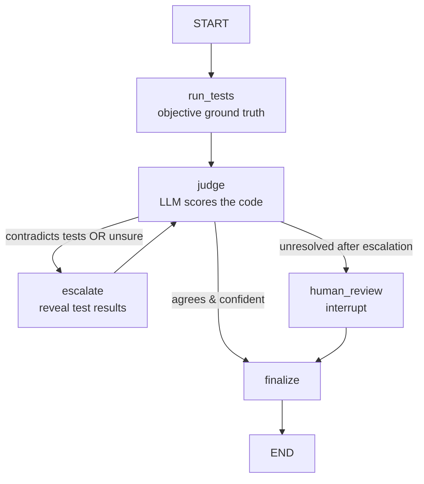

# Agentic LLM-Judge with Escalation (LangGraph)

An LLM-judge that scores code by *reading* it can be fooled by clean-looking but
wrong solutions. This project wraps the judge in a **LangGraph control loop** that
checks it against objective unit tests, **escalates** when the judge contradicts the
tests or is unsure, and falls back to a **human** when it still can't resolve.

Built as a focused study of agentic orchestration — it's the framework version of an
eval harness I first built by hand ([ai-eval-study](../ai-eval-study)).

## The graph



## What it demonstrates (the LangGraph feature surface)
- **StateGraph** with a typed, accumulating state (`log` uses a reducer so every node appends).
- **Conditional edges** — routing on judge-vs-ground-truth (`route()`).
- **Cycles** — `escalate -> judge` re-judges with the test results revealed.
- **Human-in-the-loop** — `interrupt()` + a `MemorySaver` checkpointer pause the graph
  and resume it with a human decision (`Command(resume=...)`).

## Run it
```bash
pip install -r requirements.txt
python judge_graph.py            # offline mock judge (free)
EVAL_GRAPH_REAL=1 python judge_graph.py   # real Claude judge (uses ANTHROPIC_API_KEY)
```

Sample run (mock judge), three paths:
```
correct  : run_tests 5/5 -> judge 5/0.7 (agrees, confident) -> PASS          [fast path]
buggy    : run_tests 1/5 -> judge 5/0.7 (FOOLED) -> escalate -> judge 2 -> FAIL   [loop catches it]
ambiguous: judge stays unsure -> escalate x2 -> human_review (interrupt) -> HUMAN:FAIL
```

The **buggy** case is the point: a clean-looking wrong solution fools the blind judge,
and the ground-truth escalation loop catches it — the exact judge failure mode that
makes naive LLM-as-judge setups unsafe in production.

## Talking points (for interviews)
- *Why LangGraph and not a chain?* Because the control flow has a **cycle** and
  **conditional branches** — the judge may need to be re-invoked with more context, or
  handed to a human. That's a graph, not a linear chain.
- *Why the escalation loop?* An LLM-judge is cheap and scalable but fooled by fluent-but-wrong
  output. Anchoring it to deterministic ground truth and re-judging on contradiction is how
  you get the scalability without blindly trusting the judge.
- *Human-in-the-loop?* `interrupt()` + a checkpointer lets the graph pause mid-run, surface
  its state to a person, and resume — the pattern real agent products use for approvals.
- *What's the judge?* Swappable: an offline mock for deterministic tests, or Claude (Haiku)
  behind an env flag. The graph doesn't care which — that's the point of the node boundary.

## Honest scope
A compact, working study (one task, a mock + real judge, ~200 lines). It's the framework
re-expression of hand-rolled orchestration I understand end-to-end — not a production system.
Natural extensions: more tasks, a retrieval (RAG) node, tool nodes, and persistence across runs.
