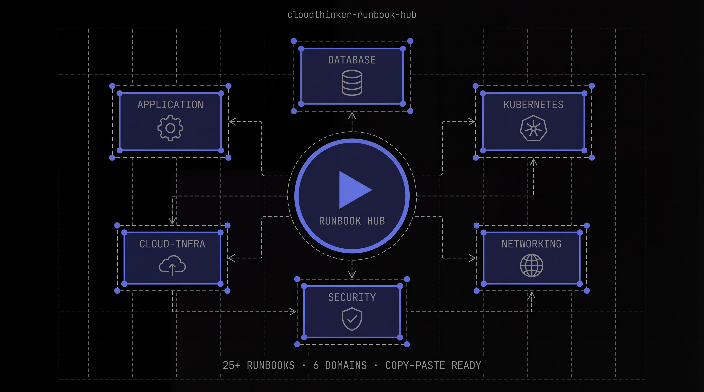

   

  <h1>Runbook Hub</h1>

  

    Open-source, production-ready incident runbooks for cloud engineering teams. 
    Browse, adopt, and contribute runbooks that help on-call engineers resolve incidents faster.
  

  
  &nbsp;
  
  &nbsp;
  
  &nbsp;
  

    

  

    

---

## What is Runbook Hub?

Runbook Hub is a community-maintained collection of **structured incident runbooks** for the most common infrastructure and application failures. Each runbook provides a step-by-step path from alert to resolution — covering triage, mitigation, verification, and escalation.

Every runbook is:

- **Copy-pasteable** — all commands use standard tools (`kubectl`, `psql`, `aws`, `redis-cli`)
- **Environment-agnostic** — generic placeholders so any team can adopt them
- **Battle-tested** — follows a consistent 11-section structure designed for 3 AM incidents
- **AI-ready** — structured for both human engineers and AI-powered incident response agents like [CloudThinker](https://cloudthinker.io)

---

## Runbook Catalog

### Application (6)

| Runbook | Severity | Difficulty |
|:--------|:--------:|:----------:|
| [5xx Error Rate Spike](application/5xx-error-rate-spike.md) | Critical | Medium |
| [API P99 Latency SLA Breach](application/api-high-latency.md) | Critical | Medium |
| [Deployment Rollback](application/deployment-rollback.md) | High | Medium |
| [Celery Worker Queue Backlog](application/celery-worker-queue-backlog.md) | High | Medium |
| [SQS Dead Letter Queue Growing](application/sqs-dead-letter-queue-growing.md) | High | Medium |
| [Application Memory Leak](application/memory-leak-diagnosis.md) | High | Hard |

### Database (5)

| Runbook | Severity | Difficulty |
|:--------|:--------:|:----------:|
| [PostgreSQL High CPU Usage](database/postgres-high-cpu.md) | High | Medium |
| [PostgreSQL Long-Running Queries](database/postgres-long-running-queries.md) | High | Medium |
| [Redis Memory Pressure](database/redis-memory-pressure.md) | High | Medium |
| [PostgreSQL Replication Lag](database/postgres-replication-lag.md) | Critical | Hard |
| [PostgreSQL Connection Pool Exhaustion](database/postgres-connection-pool-exhaustion.md) | Critical | Hard |

### Kubernetes (6)

| Runbook | Severity | Difficulty |
|:--------|:--------:|:----------:|
| [Pod CrashLoopBackOff](kubernetes/pod-crashloopbackoff.md) | Medium | Easy |
| [HPA Max Replicas Reached](kubernetes/hpa-max-replicas-reached.md) | Medium | Easy |
| [PVC Pending / Storage Full](kubernetes/pvc-pending-storage-full.md) | High | Medium |
| [OOMKilled Pod Recovery](kubernetes/oomkilled-pod-recovery.md) | High | Medium |
| [High CPU Usage (EKS)](kubernetes/high-cpu-usage-eks.md) | High | Medium |
| [Node Not Ready](kubernetes/node-not-ready.md) | Critical | Hard |

### Networking (3)

| Runbook | Severity | Difficulty |
|:--------|:--------:|:----------:|
| [SSL/TLS Certificate Expiry](networking/ssl-certificate-expiry.md) | High | Easy |
| [DNS Resolution Failure](networking/dns-resolution-failure.md) | Critical | Medium |
| [ALB 502/504 Errors](networking/alb-502-504-errors.md) | Critical | Medium |

### Security (2)

| Runbook | Severity | Difficulty |
|:--------|:--------:|:----------:|
| [Credential / Secret Leak Response](security/credential-leak-response.md) | Critical | Hard |
| [Suspicious API Activity](security/suspicious-api-activity.md) | High | Hard |

### Cloud Cost (3)

| Runbook | Severity | Difficulty |
|:--------|:--------:|:----------:|
| [Idle Resource Cleanup](cloud-cost/idle-resource-cleanup.md) | Low | Easy |
| [Unexpected Cloud Spend Spike](cloud-cost/unexpected-spend-spike.md) | Medium | Medium |
| [Right-sizing Over-provisioned Instances](cloud-cost/right-sizing-instances.md) | Low | Hard |

---

## Quick Start

**1. Fork or clone** this repository into your organization.

**2. Find & replace** the generic placeholders with your environment values:

| Placeholder | Replace With |
|:------------|:-------------|
| `<your-grafana-url>` | Your Grafana instance URL |
| `<your-monitoring-tool>` | Your monitoring tool (Datadog, New Relic, Prometheus, etc.) |
| `@your-team` | Your team's handle or on-call alias |
| `@your-escalation-contact` | Your escalation contact or manager |
| `your-domain.com` | Your organization's domain |
| `your-cluster-prod` | Your production cluster name |
| `${DB_NAME}` | Your database name |
| `service-a`, `service-b` | Your actual service names |

**3. Link to your alerting system** using the alert reference table below.

---

## Alert Quick Reference

Map these alert names to runbooks in your monitoring tool for one-click access during incidents.

| Alert Name | Runbook |
|:-----------|:--------|
| `5xxErrorRateHigh` | [5xx Error Rate Spike](application/5xx-error-rate-spike.md) |
| `APIP99LatencySLABreach` | [API P99 Latency SLA Breach](application/api-high-latency.md) |
| `DeploymentUnhealthy` | [Deployment Rollback](application/deployment-rollback.md) |
| `CeleryQueueBacklog` | [Celery Worker Queue Backlog](application/celery-worker-queue-backlog.md) |
| `SQSDeadLetterQueueGrowing` | [SQS Dead Letter Queue Growing](application/sqs-dead-letter-queue-growing.md) |
| `ApplicationMemoryLeakDetected` | [Application Memory Leak](application/memory-leak-diagnosis.md) |
| `RDSCPUUtilizationHigh` | [PostgreSQL High CPU Usage](database/postgres-high-cpu.md) |
| `PostgresLongRunningQuery` | [PostgreSQL Long-Running Queries](database/postgres-long-running-queries.md) |
| `RDSReplicationLagHigh` | [PostgreSQL Replication Lag](database/postgres-replication-lag.md) |
| `PgBouncerConnectionPoolExhausted` | [PostgreSQL Connection Pool Exhaustion](database/postgres-connection-pool-exhaustion.md) |
| `RedisMemoryUtilizationHigh` | [Redis Memory Pressure](database/redis-memory-pressure.md) |
| `PodCrashLoopBackOff` | [Pod CrashLoopBackOff](kubernetes/pod-crashloopbackoff.md) |
| `HPAMaxReplicasReached` | [HPA Max Replicas Reached](kubernetes/hpa-max-replicas-reached.md) |
| `PVCPendingOrStorageFull` | [PVC Pending / Storage Full](kubernetes/pvc-pending-storage-full.md) |
| `OOMKilledPod` | [OOMKilled Pod Recovery](kubernetes/oomkilled-pod-recovery.md) |
| `HighCPUUsageEKS` | [High CPU Usage (EKS)](kubernetes/high-cpu-usage-eks.md) |
| `KubernetesNodeNotReady` | [Node Not Ready](kubernetes/node-not-ready.md) |
| `SSLCertificateExpiringSoon` | [SSL/TLS Certificate Expiry](networking/ssl-certificate-expiry.md) |
| `DNSResolutionFailure` | [DNS Resolution Failure](networking/dns-resolution-failure.md) |
| `ALB5xxErrors` | [ALB 502/504 Errors](networking/alb-502-504-errors.md) |
| `CredentialLeakDetected` | [Credential / Secret Leak Response](security/credential-leak-response.md) |
| `SuspiciousAPIActivity` | [Suspicious API Activity](security/suspicious-api-activity.md) |
| `CloudSpendAnomaly` | [Unexpected Cloud Spend Spike](cloud-cost/unexpected-spend-spike.md) |

---

## Runbook Structure

Every runbook follows a consistent 11-section format. Use the [template](templates/runbook-template.md) when writing new ones.

| Section | Purpose |
|:--------|:--------|
| **Metadata** | Service, owner, severity, last updated |
| **Summary** | One-line description of the incident type |
| **Impact** | What breaks when this happens |
| **Prerequisites** | Tools, access, and permissions needed |
| **Triage & Diagnosis** | How to confirm and scope the problem |
| **Mitigation Steps** | Step-by-step resolution procedures |
| **Verification** | How to confirm the fix worked |
| **Rollback** | How to undo changes if mitigation fails |
| **Escalation** | Who to contact and when |
| **Related Runbooks** | Links to related incident types |
| **Changelog** | History of updates to the runbook |

---

## Contributing

We welcome runbooks that encode real-world operational expertise.

1. **Fork** this repository
2. **Copy** `templates/runbook-template.md` into the appropriate domain directory
3. **Write** your runbook following the 11-section structure
4. **Open a pull request** with the `runbook` label

Read [CONTRIBUTING.md](CONTRIBUTING.md) for the quality checklist and review process.

### Runbooks We'd Love to See

- MongoDB replication issues
- Kafka consumer lag
- Elasticsearch cluster health
- GitHub Actions workflow failures
- Terraform state lock issues
- Docker registry storage full
- gRPC deadline exceeded errors
- AWS Lambda cold start optimization

---

## License

MIT — see [LICENSE](LICENSE)

   
  Built with care by <a href="https://cloudthinker.io">CloudThinker</a>

